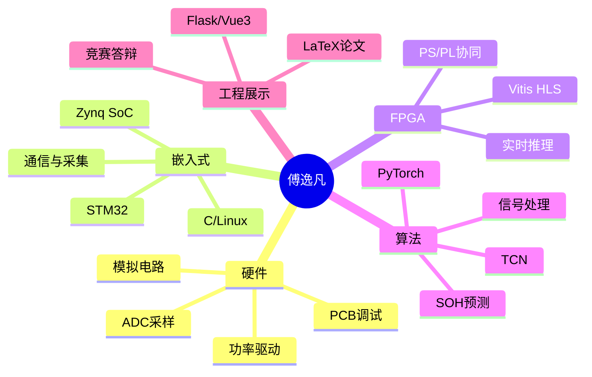
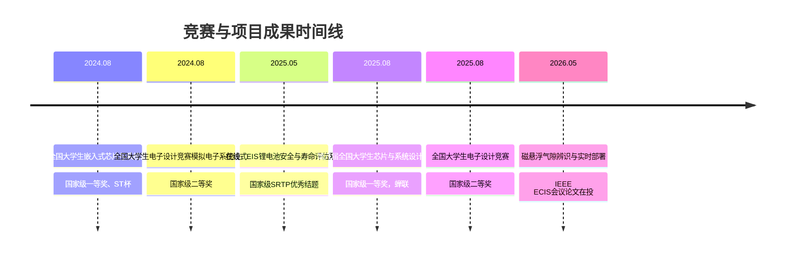

# 傅逸凡｜面试自我介绍

### 嵌入式系统 · 硬件电路 · FPGA/Zynq · 智能测量 · 工程闭环

**西南交通大学｜电子信息工程｜本科在读**  
GPA **3.78/4.0**｜专业排名 **2/63，前 3%**｜CET-4 **623**｜CET-6 **573**  
📧 fu1fan@my.swjtu.edu.cn ｜ ☎️ (+86) 13362835663 ｜ 微信：_fu1fan

---

## 01｜一句话介绍

我是一名具备 **软硬件全栈开发能力** 的电子信息本科生，长期围绕 **嵌入式系统、模拟/数字电路、FPGA 实时部署、智能测量与工程化系统集成** 开展项目实践；能够从问题定义、方案设计、硬件调试、嵌入式开发、算法训练到系统展示，独立推进完整工程闭环。

> [!summary] 我的核心特点
> - **工程能力强**：能做原理图、调电路、写嵌入式代码，也能搭建可视化系统。
> - **学习速度快**：能在短时间内上手新技术、新工具和新方向。
> - **项目闭环完整**：有国创 SRTP、国家级竞赛、论文写作与答辩展示经验。
> - **沟通组织能力强**：多次担任队长，负责方案统筹、任务拆解与最终汇报。

---

## 02｜能力地图

| 能力方向 | 关键词 | 代表经历 |
|---|---|---|
| **硬件电路设计** | 模拟电路、ADC 采样、功率驱动、阻抗测量、四线电桥 | 磁悬浮实验主板、EIS 阻抗测量电路、电赛双绞线测试仪 |
| **嵌入式系统** | STM32、Zynq SoC、C、Linux、传感采集、通信 | 锂电池在线 EIS 检测平台、磁悬浮实时推理系统 |
| **FPGA / Zynq** | Vitis HLS、PS/PL 协同、低时延部署 | TCN 气隙软测量模型部署至 Zynq PL 端 |
| **算法与数据** | PyTorch、TCN、信号处理、SOH 预测 | 磁悬浮气隙估计、锂电池健康状态评估 |
| **软件与可视化** | Flask、Vue3、IoT 系统、数据展示 | 锂电池安全与寿命评估系统可视化平台 |
| **学术与表达** | LaTeX、Zotero、英文论文、答辩展示 | IEEE ECIS 会议论文在投、国创结题、竞赛答辩 |

---

## 03｜核心项目一：基于 FPGA 的磁悬浮气隙辨识与无气隙传感器控制

**项目类型**：国家级 SRTP  
**时间**：2025.05—2026.05（预计）  
**关键词**：磁悬浮｜Zynq SoC｜TCN｜Vitis HLS｜实时控制｜传感器冗余测量

### 项目背景

磁悬浮系统对气隙测量与控制实时性要求很高。传统方案依赖气隙传感器，但在成本、可靠性和系统集成方面存在限制。因此，本项目尝试利用电磁信号之间的解析冗余关系，构建 **无气隙传感器的气隙软测量方法**。

### 我的工作

- 设计并调试集成 **Zynq SoC、磁悬浮功率驱动、信号处理前端、ADC 采样电路** 的一体式实验主板。
- 在多种悬浮工况下采集实验数据，使用 **PyTorch** 训练 TCN 网络，实现气隙高精度辨识。
- 使用 **Vitis HLS** 将 TCN 模型部署至 Zynq SoC 的 PL 端，实现在线实时推理。

### 项目结果

| 指标 | 结果 |
|---|---:|
| 气隙估计误差 | MAE = **1.364 ADC counts**，约 **0.011 mm** |
| 单次在线推理时延 | **17.24 μs** |
| 实时控制适配能力 | 满足 **10 kHz** 控制要求 |
| 学术产出 | 第一作者会议论文 IEEE ECIS 在投，扩刊论文计划投递 Measurement |

> [!tip] 面试表达重点
> 这个项目最能体现我把 **硬件采集、神经网络建模、FPGA 低时延部署和控制系统需求** 串起来的能力。它不是单点算法实验，而是面向实时控制场景的系统级实现。

---

## 04｜核心项目二：基于在线式 EIS 检测的锂电池安全与寿命评估系统

**项目类型**：国家级 SRTP  
**时间**：2023.12—2025.05  
**关键词**：EIS｜锂电池｜STM32｜模拟前端｜SOH 预测｜Flask/Vue3｜IoT

### 项目背景

锂电池的安全状态和寿命评估对于储能、电动车与嵌入式电源管理都非常关键。EIS（电化学阻抗谱）能够反映电池内部状态，但传统设备成本较高、在线部署难度较大。因此，本项目构建了一个面向在线检测的嵌入式 EIS 测量与寿命评估系统。

### 我的工作

- 设计并反复调试 **阻抗测量模拟电路**，提升系统阻抗测量精度。
- 基于 **STM32 Stellar 系列车规级 MCU** 开展嵌入式系统设计。
- 使用 **Flask + Vue3** 搭建可视化界面，形成完整的物联网阻抗在线测量系统。
- 作为队长带队参加第七届全国大学生嵌入式芯片与系统设计竞赛。

### 项目结果

| 指标 | 结果 |
|---|---:|
| 阻抗检测频段 | **1 Hz–2 kHz** |
| 阻抗测量精度 | 约 **2%** |
| SOH 预测准确率 | 超过 **90%** |
| 项目结题 | 国家级 SRTP **优秀结题** |
| 竞赛成果 | 全国总决赛 **一等奖** + **ST 杯** |

> [!tip] 面试表达重点
> 这个项目体现了我从 **模拟电路、嵌入式控制、数据预测、前后端可视化到竞赛答辩** 的完整系统开发能力，也说明我能够承担队长角色并推动项目落地。

---

## 05｜核心项目三：简易以太网双绞线测试仪

**项目类型**：2025 年全国大学生电子设计竞赛  
**时间**：2025.08  
**关键词**：电赛｜四线电桥｜驻波法｜线缆检测｜阻抗测量｜队长

### 项目背景

该作品面向以太网双绞线检测场景，需要实现线序识别、线缆类型判断、阻抗测量、线长估计与短路定位等功能。项目在有限时间内完成方案论证、硬件搭建、算法实现与现场测试。

### 我的工作

- 作为队长统筹作品整体方案设计和任务分工。
- 提出基于 **驻波法** 的线缆长度单端测量方案。
- 提出采用 **四线精密电桥** 测量导线电阻的方案，并将测量精度校准至 **0.1 mΩ** 级别。
- 赛前设计并调试关键模块，如四线高精度电桥等。

### 项目结果

| 指标 | 结果 |
|---|---:|
| 阻抗测量最大相对误差 | **2.3%** |
| 长度测量最大相对误差 | **1.3%** |
| 赛区表现 | 四川赛区作品指标最高 |
| 竞赛成果 | 全国大学生电子设计竞赛 **国家级二等奖** |

> [!tip] 面试表达重点
> 这个项目可以突出我在高压竞赛环境下的 **快速方案设计、硬件调试、误差校准和团队协作** 能力。

---

## 06｜竞赛与荣誉

| 奖项 / 经历 | 级别 | 时间 |
|---|---|---:|
| 第七届全国大学生嵌入式芯片与系统设计大赛 | 国家级一等奖、ST 杯 | 2024.08 |
| 全国大学生电子设计竞赛模拟电子系统设计专题赛 | 国家级二等奖 | 2024.08 |
| 第八届全国大学生芯片与系统设计大赛 | 国家级一等奖，蝉联 | 2025.08 |
| 全国大学生电子设计竞赛 | 国家级二等奖 | 2025.08 |
| 一等综合奖学金、三好学生、优秀共青团员/干部等 | 校级 | 多次 |

---

## 07｜我能为团队带来的价值

> [!success] 如果加入团队，我希望贡献的是“能把事情做成”的工程能力。

### 1. 能快速进入新问题

我习惯通过文献、开源资料、数据手册和实验验证快速理解新方向，通常可以在较短时间内完成工具链搭建、关键原理理解与初版方案实现。

### 2. 能独立推进工程闭环

我不只关注单个模块，而是会主动思考系统的完整链路：

### 3. 能在团队中承担组织和表达角色

我曾担任学院辩论队队长、校电子科技协会会长，也多次负责竞赛队伍统筹和最终答辩。因此我比较适合承担需要 **沟通协调、技术拆解、进度推进和结果呈现** 的任务。

---

## 08｜30 秒自我介绍稿

您好，我叫傅逸凡，是西南交通大学电子信息工程专业本科生，目前 GPA 3.78，专业排名 2/63。我的主要方向是嵌入式系统、硬件电路和 FPGA 实时部署。

本科期间我参与了多个工程型项目。例如，在磁悬浮气隙辨识项目中，我设计了集成 Zynq、功率驱动和 ADC 采样的一体式实验主板，并将 TCN 网络通过 Vitis HLS 部署到 Zynq PL 端，实现了 17.24 微秒的在线推理时延，满足 10 kHz 实时控制需求。另一个锂电池 EIS 项目中，我负责阻抗测量模拟电路和嵌入式系统开发，最终项目获得国家级 SRTP 优秀结题，并在嵌入式芯片与系统设计竞赛中获得全国一等奖和 ST 杯。

我认为自己的特点是学习速度快、工程闭环能力强，既能做硬件调试，也能写嵌入式和上层应用，还能参与算法建模和论文写作。希望未来能在嵌入式、智能硬件、测量系统或 FPGA 相关方向继续深入发展。

---

## 09｜面试官可能会追问的问题

| 方向 | 可能问题 | 准备重点 |
|---|---|---|
| 磁悬浮项目 | 为什么选择 TCN？相比传统方法优势是什么？ | 时序建模、低时延、部署友好性 |
| FPGA 部署 | Vitis HLS 部署时做了哪些优化？ | 定点化、流水线、资源/时延权衡 |
| 硬件设计 | ADC 采样和模拟前端如何保证精度？ | 噪声、滤波、布局布线、标定 |
| EIS 项目 | 如何实现宽频阻抗测量？误差来源有哪些？ | 激励信号、采样、相位/幅值计算 |
| 电赛项目 | 驻波法测线长的原理是什么？ | 反射、频率扫描、误差校准 |
| 团队协作 | 队长如何分工和推进进度？ | 任务拆解、风险管理、答辩呈现 |

---

## 结尾

**我希望成为一名既懂硬件底层、又能完成系统级工程落地的电子信息工程师。**

