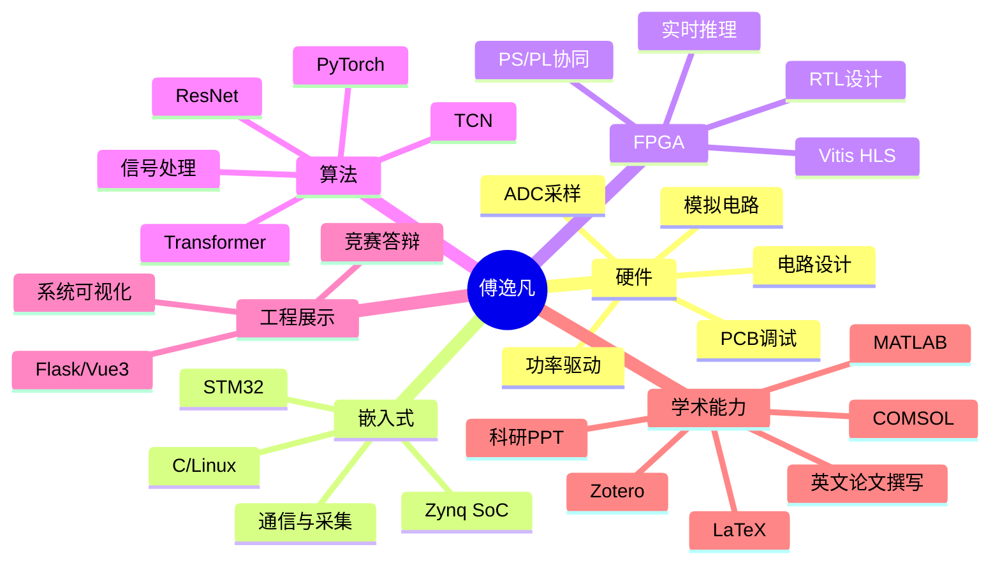
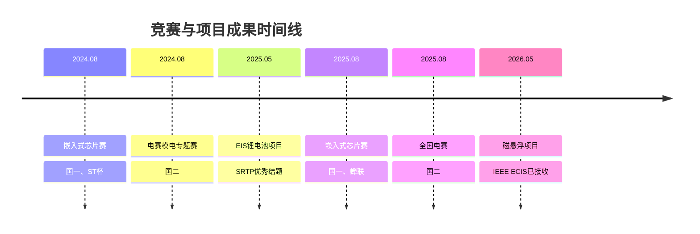

# 傅逸凡｜面试自我介绍

> **嵌入式系统 · 硬件电路 · FPGA/Zynq · 高效智能计算 · 工程闭环**

**西南交通大学｜电子信息工程｜本科在读**  
**GPA：3.78/4.0** ｜ **专业排名：2/63，前 3%** ｜ **CET-4：623** ｜ **CET-6：573**  
📧 fu1fan@my.swjtu.edu.cn ｜ ☎️ **(+86) 13362835663**

---

## 01｜介绍

我是一名具备 **软硬件全栈开发能力** 的电子信息本科生，长期围绕 **嵌入式系统、模拟/数字电路、FPGA 实时部署、智能测量与工程化系统集成** 开展项目实践；能够从问题定义、方案设计、硬件调试、嵌入式开发、算法训练到系统展示，独立推进完整工程闭环。

- 大一加入实验室开始做电赛
![[CB71776D-A049-4EAE-BB3D-46346276279C_1_102_o.jpeg|697]]
![[A3B41408-6ECD-4922-82A1-060BEE7F91A5_1_102_o.jpeg]]
> [!summary] 我的核心特点
> - **工程能力强**：能做原理图、调电路、写嵌入式代码，也能设计、部署深度学习算法，等
> - **学习速度快**：能在短时间内自主上手新技术、新工具和新方向。
> - **项目闭环完整**：有国创 SRTP、国家级竞赛、论文写作与答辩展示经验。
> - **沟通组织能力强**：多次担任队长，负责方案统筹、任务拆解与最终汇报。

---

## 02｜能力地图

| 能力方向            | 关键词                                 | 代表经历                             |
| --------------- | ----------------------------------- | -------------------------------- |
| **硬件电路设计**      | 电路设计、模拟电路、ADC 采样、功率驱动、阻抗测量、四线电桥     | 磁悬浮实验主板、EIS 阻抗测量电路、电赛双绞线测试仪      |
| **嵌入式系统**       | STM32、Zynq SoC、C、Linux、传感采集、通信      | 锂电池在线 EIS 检测平台、磁悬浮实时推理系统         |
| **FPGA / Zynq** | Vitis HLS、PS/PL 协同、低时延部署            | TCN 气隙软测量模型部署至 Zynq PL 端         |
| **算法与数据**       | PyTorch、TCN、ResNet、Transformer、信号处理 | 磁悬浮气隙估计、锂电池健康状态评估                |
| **软件与可视化**      | Flask、Vue3、IoT 系统、数据展示              | 锂电池安全与寿命评估系统可视化平台                |
| **学术科研能力**      | MATLAB、COMSOL、LaTeX、英文论文撰写、Zotero、科研 PPT | 建模仿真、IEEE ECIS 会议论文已接受、国创结题、竞赛答辩 |

---

## 03｜核心项目一：基于 FPGA 的磁悬浮气隙辨识与无气隙传感器控制

**项目类型**：国家级 SRTP  
**时间**：2025.05—2026.05（预计）  
**关键词**：磁悬浮｜Zynq SoC｜TCN｜Vitis HLS｜实时控制｜传感器冗余测量
[[项目图片.pdf#page=3&selection=0,0,10,8&color=yellow|项目图片, p.3]]
### 项目背景

磁悬浮系统对气隙测量与控制实时性要求很高。传统方案依赖气隙传感器，但在成本、可靠性和系统集成方面存在限制。因此，本项目尝试利用电磁信号之间的解析冗余关系，构建 **无气隙传感器的气隙软测量方法**。

### 我的工作

- 设计并调试集成 **Zynq SoC、磁悬浮功率驱动、信号处理前端、ADC 采样电路** 的一体式实验主板。
- 在多种悬浮工况下采集实验数据，使用 **PyTorch** 训练 TCN 网络，实现气隙高精度辨识。
- 使用 **Vitis HLS** 将 TCN 模型部署至 Zynq SoC 的 PL 端，实现在线实时推理。

### 项目结果

| 指标       |                                          结果 |
| -------- | ------------------------------------------: |
| 气隙估计误差   |   MAE = **1.364 ADC counts**，约 **0.011 mm** |
| 单次在线推理时延 |                                **17.24 μs** |
| 实时控制适配能力 |                          满足 **10 kHz** 控制要求 |
| 学术产出     | 第一作者会议论文 IEEE ECIS 已通过，扩刊论文计划投递 Measurement |
![[Pasted image 20260509090315.png]]
![[Pasted image 20260509090328.png]]

---

## 04｜核心项目二：基于在线式 EIS 检测的锂电池安全与寿命评估系统

**项目类型**：国家级 SRTP  
**时间**：2023.12—2025.05  
**关键词**：EIS｜锂电池｜STM32｜模拟前端｜SOH 预测｜Flask/Vue3｜IoT
[[项目图片.pdf#page=13&selection=0,0,10,1&color=yellow|项目图片, p.13]]

### 项目背景

锂电池的安全状态和寿命评估对于储能、电动车与嵌入式电源管理都非常关键。EIS（电化学阻抗谱）能够反映电池内部状态，但传统设备成本较高、在线部署难度较大。因此，本项目构建了一个面向在线检测的嵌入式 EIS 测量与寿命评估系统。

### 我的工作

- 设计并反复调试 **阻抗测量模拟电路**，提升系统阻抗测量精度。
- 基于 **STM32 Stellar 系列车规级 MCU** 开展嵌入式系统设计。
- 使用 **Flask + Vue3** 搭建可视化界面，形成完整的物联网阻抗在线测量系统。
- 作为队长带队参加第七届全国大学生嵌入式芯片与系统设计竞赛。

### 项目结果

| 指标 | 结果 |
|---|---:|
| 阻抗检测频段 | **1 Hz–2 kHz** |
| 阻抗测量精度 | 约 **2%** |
| SOH 预测准确率 | 超过 **90%** |
| 项目结题 | 国家级 SRTP **优秀结题** |
| 竞赛成果 | 全国总决赛 **一等奖** + **ST 杯** |
![[Pasted image 20260509090456.png|697]]
![[Pasted image 20260509090509.png]]

---

## 05｜核心项目三：简易以太网双绞线测试仪

**项目类型**：2025 年全国大学生电子设计竞赛  
**时间**：2025.08  
**关键词**：电赛｜四线电桥｜驻波法｜线缆检测｜阻抗测量｜队长
[[项目图片.pdf#page=22&selection=0,0,0,8&color=yellow|项目图片, p.22]]

### 项目背景

该作品面向以太网双绞线检测场景，需要实现线序识别、线缆类型判断、阻抗测量、线长估计与短路定位等功能。项目在有限时间内完成方案论证、硬件搭建、算法实现与现场测试。

### 我的工作

- 作为队长统筹作品整体方案设计和任务分工。
- 提出基于 **驻波法** 的线缆长度单端测量方案。
- 提出采用 **四线精密电桥** 测量导线电阻的方案，并将测量精度校准至 **0.1 mΩ** 级别。
- 赛前设计并调试关键模块，如四线高精度电桥等。

### 项目结果

| 指标 | 结果 |
|---|---:|
| 阻抗测量最大相对误差 | **2.3%** |
| 长度测量最大相对误差 | **1.3%** |
| 赛区表现 | 四川赛区作品指标最高 |
| 竞赛成果 | 全国大学生电子设计竞赛 **国家级二等奖** |
![[Pasted image 20260509090539.png]]

---

## 06｜竞赛与荣誉

| 奖项 / 经历                 | 级别          |      时间 |
| ----------------------- | ----------- | ------: |
| 第七届全国大学生嵌入式芯片与系统设计大赛    | 国家级一等奖、ST 杯 | 2024.08 |
| 全国大学生电子设计竞赛模拟电子系统设计专题赛  | 国家级二等奖      | 2024.08 |
| 第八届全国大学生芯片与系统设计大赛       | 国家级一等奖，蝉联   | 2025.08 |
| 全国大学生电子设计竞赛             | 国家级二等奖      | 2025.08 |
| 一等综合奖学金、三好学生、优秀共青团员/干部等 | 校级          |      多次 |

---
## 07 | RA经历

### 清华 TIIM LAB｜晶圆缺陷识别与深度学习实验平台

围绕 **WM-811K 晶圆缺陷数据集**，参与晶圆缺陷模式识别实验，搭建从数据处理、模型训练、评估到可视化分析的完整实验流程。

- 完成 wafer map 数据处理与 PyTorch 训练框架搭建，支持二分类与 9 类缺陷模式分类。
- 基于 **ResNet18 / ResNet50 / ConvNeXt / EfficientNetV2** 等模型开展对比实验，分析类别不平衡与少数类召回问题。
- 通过 **Focal Loss、class-balanced sampling、GeM、cRT、logit adjustment** 等方法优化多分类性能，并整理阶段性研究日志与实验结论。

### 西安交通大学｜GNSS信号欺骗项目｜FPGA顾问
![[2026-05-09_09-18-36.png]]

---
## 08｜我能为团队带来的价值

> [!success] 如果加入团队，我希望贡献的是“能把事情做成”的工程能力。

### 1. 能快速进入新问题

我习惯通过文献、开源资料、数据手册和实验验证快速理解新方向，通常可以在较短时间内完成工具链搭建、关键原理理解与初版方案实现。

### 2. 能独立推进工程闭环

我不只关注单个模块，而是会主动思考系统的完整链路：

### 3. 能在团队中承担组织和表达角色

我曾担任学院辩论队队长、校电子科技协会会长，也多次负责竞赛队伍统筹和最终答辩。因此我比较适合承担需要 **沟通协调、技术拆解、进度推进和结果呈现** 的任务。

---
