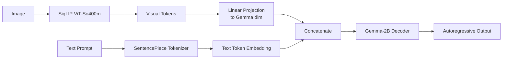
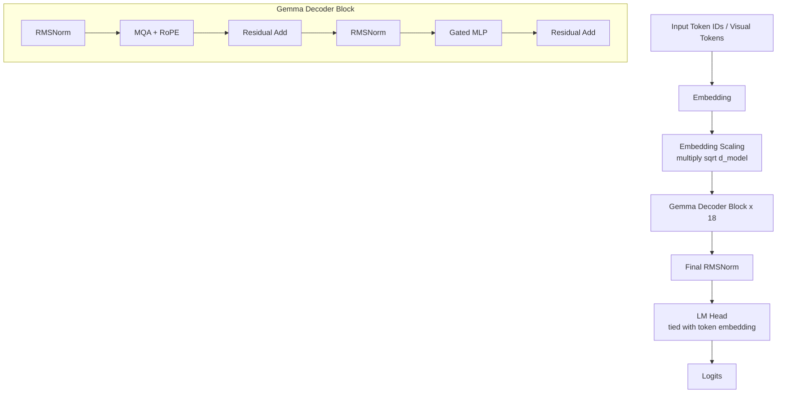
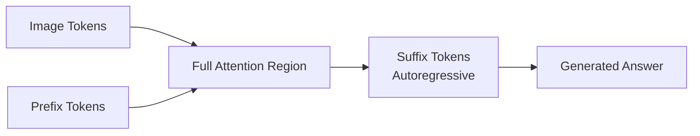
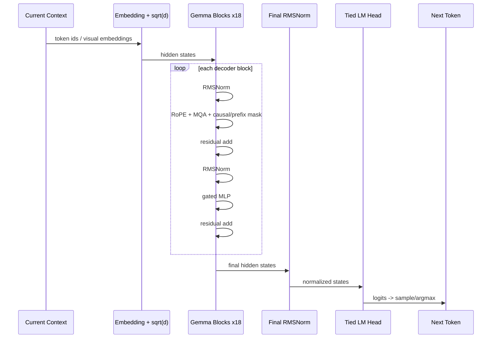

# Gemma-2B

> 参考：[[libs/biblib/beyerpaligemma2024/beyerpaligemma2024.pdf|PaliGemma: A versatile 3B VLM for transfer]] 使用的是 **Gemma-2B v1.0 raw pretrained checkpoint** 作为语言模型部分。注意这里说的是 **Gemma 2B / Gemma-2B v1**，不是后来的 **Gemma 2 2B**。
>
> 本文只整理 Gemma-2B 相比“标准 Transformer decoder”更需要注意的计算差异；标准的 Q/K/V attention、残差连接、MLP 主流程不重复展开。

---

## 1. 在 PaliGemma 中的位置

PaliGemma 的语言部分来自 Gemma-2B。SigLIP 负责把图像编码成 visual tokens，随后通过线性层投影到 Gemma 的 embedding 空间，再和文本 token 拼接，送入 Gemma decoder。



在纯 Gemma-2B 中，输入只有文本 token；在 PaliGemma 中，输入变成：

$$
[\text{image tokens},\ \text{BOS},\ \text{prefix tokens},\ \text{SEP},\ \text{suffix tokens}]
$$

---

## 2. 关键配置速记

Gemma-2B v1 常见结构可概括为：

| 项目 | 典型值 |
|---|---:|
| 模型类型 | decoder-only causal LM |
| 词表大小 | $\approx 256\text{k}$ |
| hidden size | $d_{model}=2048$ |
| Transformer layers | $18$ |
| query heads | $8$ |
| KV heads | $1$ |
| head dimension | $256$ |
| FFN intermediate size | $16384$ |
| position encoding | RoPE |
| normalization | RMSNorm |
| attention 类型 | Multi-Query Attention, MQA |
| MLP 类型 | gated MLP / GeGLU-like |

其中：

$$
8 \times 256 = 2048
$$

所以 query heads 拼接后仍回到 $d_{model}=2048$。

---

## 3. 与标准 Transformer 的主要不同点



和普通 Transformer decoder 相比，重点差异是：

1. **RMSNorm 替代 LayerNorm**；
2. **RoPE 替代绝对位置编码**；
3. **Multi-Query Attention**：多个 query heads 共享一组 K/V；
4. **Gated MLP**：不是普通两层 FFN；
5. **embedding 会乘 $\sqrt{d_{model}}$**；
6. **输入/输出 embedding 权重共享**；
7. 在 PaliGemma 中，attention mask 不是纯文本 causal mask，而是 **Prefix-LM mask**。

---

## 4. Embedding 缩放

标准 Transformer 常见做法是：token embedding 加 position embedding 后送入 block。

Gemma 中，token embedding 后会乘一个缩放因子：

$$
H^{(0)} = \sqrt{d_{model}} \cdot E[x]
$$

其中：

$$
E[x] \in \mathbb{R}^{T \times d_{model}}
$$

$$
d_{model}=2048
$$

所以：

$$
H^{(0)} = \sqrt{2048} \cdot E[x]
$$

这个缩放可以理解为让 embedding 的数值尺度和后续 residual stream 更匹配。

在 PaliGemma 中，文本 token 来自 Gemma 的 embedding table；图像 token 则来自：

$$
V_{img} = H_{siglip} W_{proj} + b_{proj}
$$

然后二者在序列维度拼接。

---

## 5. RMSNorm 替代 LayerNorm

标准 LayerNorm 会减去均值并除以标准差：

$$
\operatorname{LN}(x)=\frac{x-\mu}{\sqrt{\sigma^2+\epsilon}} \odot \gamma + \beta
$$

Gemma 使用的是 RMSNorm。RMSNorm 不减均值，只用均方根做归一化：

$$
\operatorname{RMS}(x)=\sqrt{\frac{1}{d}\sum_{i=1}^{d}x_i^2+\epsilon}
$$

$$
\operatorname{RMSNorm}(x)=\frac{x}{\operatorname{RMS}(x)} \odot w
$$

Gemma 实现中常见的是以 $1+w$ 作为缩放项：

$$
\operatorname{GemmaRMSNorm}(x)=\frac{x}{\sqrt{\frac{1}{d}\sum_{i=1}^{d}x_i^2+\epsilon}} \odot (1+w)
$$

这和标准 LayerNorm 的差别是：

- 不做 mean centering；
- 通常没有 bias；
- 计算更简单；
- 更接近 LLaMA 系列使用的 pre-norm 风格。

---

## 6. RoPE 替代绝对位置编码

标准 Transformer 可以使用 learned absolute position embedding：

$$
H^{(0)} = E[x] + P_{pos}
$$

Gemma 使用 RoPE，也就是 Rotary Position Embedding。RoPE 不直接加到 token embedding 上，而是在 attention 里作用于 $Q$ 和 $K$。

对于位置 $m$ 的 query/key 向量，每两个维度组成一组二维向量：

$$
\begin{bmatrix}
q_{2i} \\
q_{2i+1}
\end{bmatrix}
$$

RoPE 对它做旋转：

$$
\begin{bmatrix}
q'_{2i} \\
q'_{2i+1}
\end{bmatrix}
=
\begin{bmatrix}
\cos(m\theta_i) & -\sin(m\theta_i) \\
\sin(m\theta_i) & \cos(m\theta_i)
\end{bmatrix}
\begin{bmatrix}
q_{2i} \\
q_{2i+1}
\end{bmatrix}
$$

同样地：

$$
K \rightarrow K_{rope}
$$

于是 attention score 变成：

$$
S = \frac{Q_{rope}K_{rope}^{\top}}{\sqrt{d_h}}
$$

RoPE 的作用是把位置信息编码进 token 之间的相对相位关系中。

---

## 7. Multi-Query Attention, MQA

标准 Multi-Head Attention 通常每个 head 都有自己的 $Q,K,V$：

$$
Q_j = XW_{Q,j}, \quad K_j = XW_{K,j}, \quad V_j = XW_{V,j}
$$

Gemma-2B 使用 Multi-Query Attention：

- query 有多个 heads；
- key/value 只有一组 head；
- 所有 query heads 共享同一组 K/V。

设：

$$
h_q = 8
$$

$$
h_{kv} = 1
$$

$$
d_h = 256
$$

则：

$$
Q \in \mathbb{R}^{T \times h_q \times d_h}
$$

$$
K \in \mathbb{R}^{T \times h_{kv} \times d_h}
$$

$$
V \in \mathbb{R}^{T \times h_{kv} \times d_h}
$$

由于 $h_{kv}=1$，所以 K/V 会被 broadcast 或 repeat 给每个 query head 使用：

$$
K_j = K, \quad V_j = V, \quad j=1,2,\dots,h_q
$$

第 $j$ 个 query head 的 attention 为：

$$
A_j = \operatorname{softmax}\left(\frac{Q_jK^\top}{\sqrt{d_h}} + M\right)
$$

$$
O_j = A_jV
$$

其中 $M$ 是 attention mask。

最后拼接所有 query heads：

$$
O = \operatorname{Concat}(O_1,O_2,\dots,O_{h_q})
$$

$$
O \in \mathbb{R}^{T \times (h_q d_h)} = \mathbb{R}^{T \times 2048}
$$

再做输出投影：

$$
\operatorname{MQA}(X)=OW_O
$$

### 为什么使用 MQA？

MQA 最大的工程意义是降低 KV cache。

标准 MHA 的 KV cache 规模近似为：

$$
T \times h_q \times d_h \times 2
$$

Gemma-2B MQA 的 KV cache 规模为：

$$
T \times h_{kv} \times d_h \times 2
$$

二者比例：

$$
\frac{h_{kv}}{h_q}=\frac{1}{8}
$$

所以在长上下文自回归推理时，MQA 可以显著减少 KV cache 显存占用。

---

## 8. Gated MLP / GeGLU-like FFN

标准 Transformer FFN 通常是：

$$
\operatorname{FFN}(x)=W_2\sigma(W_1x)
$$

Gemma 使用 gated MLP，形式更接近 GeGLU / gated GELU：

$$
g = \operatorname{GELU}(xW_{gate})
$$

$$
u = xW_{up}
$$

$$
\operatorname{MLP}(x)=(g \odot u)W_{down}
$$

其中：

$$
W_{gate}: d_{model} \rightarrow d_{ff}
$$

$$
W_{up}: d_{model} \rightarrow d_{ff}
$$

$$
W_{down}: d_{ff} \rightarrow d_{model}
$$

Gemma-2B 中：

$$
d_{model}=2048
$$

$$
d_{ff}=16384
$$

所以：

$$
W_{gate}: 2048 \rightarrow 16384
$$

$$
W_{up}: 2048 \rightarrow 16384
$$

$$
W_{down}: 16384 \rightarrow 2048
$$

这个结构比普通 FFN 多了一个 gate 分支，表达能力更强。

---

## 9. Gemma Decoder Block 的计算

设第 $l$ 层输入为：

$$
H^{(l)} \in \mathbb{R}^{T \times d_{model}}
$$

### 9.1 Attention 子层

先 RMSNorm：

$$
U^{(l)} = \operatorname{RMSNorm}(H^{(l)})
$$

然后做带 RoPE 的 MQA：

$$
A^{(l)} = \operatorname{MQA}_{RoPE}(U^{(l)}, M)
$$

残差连接：

$$
\tilde{H}^{(l)} = H^{(l)} + A^{(l)}
$$

### 9.2 MLP 子层

再 RMSNorm：

$$
V^{(l)} = \operatorname{RMSNorm}(\tilde{H}^{(l)})
$$

经过 gated MLP：

$$
F^{(l)} = \operatorname{GatedMLP}(V^{(l)})
$$

残差连接：

$$
H^{(l+1)} = \tilde{H}^{(l)} + F^{(l)}
$$

整体就是：

$$
\tilde{H}^{(l)} = H^{(l)} + \operatorname{MQA}_{RoPE}(\operatorname{RMSNorm}(H^{(l)}),M)
$$

$$
H^{(l+1)} = \tilde{H}^{(l)} + \operatorname{GatedMLP}(\operatorname{RMSNorm}(\tilde{H}^{(l)}))
$$

---

## 10. Causal mask 与 PaliGemma 的 Prefix-LM mask

### 10.1 纯 Gemma-2B 的 causal mask

作为普通语言模型时，Gemma-2B 使用 causal self-attention：第 $t$ 个 token 只能看见自己和之前的 token。

mask 为：

$$
M_{ij}=\begin{cases}
0, & j \le i \\
-\infty, & j > i
\end{cases}
$$

attention 为：

$$
A=\operatorname{softmax}\left(\frac{QK^\top}{\sqrt{d_h}}+M\right)
$$

### 10.2 PaliGemma 中的 Prefix-LM mask

PaliGemma 不是简单地把所有 token 都做 causal mask，而是使用 Prefix-LM 风格：

```text
[image tokens] [BOS prefix SEP] [suffix answer]
```

其中：

- image tokens 和 prefix tokens 之间使用 full attention；
- suffix answer tokens 使用 autoregressive attention；
- suffix 可以看见 image + prefix + 之前的 suffix；
- image + prefix 不需要看见 suffix 的未来答案。



用集合表示，设：

$$
\mathcal{P}=\{\text{image tokens and prefix tokens}\}
$$

$$
\mathcal{S}=\{\text{suffix tokens}\}
$$

则：

- 若 $i \in \mathcal{P}$，它可以看所有 prefix 区域 token；
- 若 $i \in \mathcal{S}$，它可以看 $\mathcal{P}$ 以及 $\mathcal{S}$ 中不晚于自己的 token。

这就是 PaliGemma 中 Gemma decoder 和普通 causal LM 最大的使用差异之一。

---

## 11. 输出层与权重共享

Gemma 使用 tied word embeddings，即输入 embedding table 和输出 LM head 权重共享。

输入 embedding：

$$
E \in \mathbb{R}^{V \times d_{model}}
$$

最终 hidden state：

$$
H^{(L)} \in \mathbb{R}^{T \times d_{model}}
$$

先做 final RMSNorm：

$$
Z = \operatorname{RMSNorm}(H^{(L)})
$$

输出 logits：

$$
\operatorname{logits}=ZE^\top
$$

其中：

$$
\operatorname{logits} \in \mathbb{R}^{T \times V}
$$

$V$ 是词表大小。

---

## 12. 一次 token 生成的计算流程



---

## 13. 核心差异公式速记

Embedding scaling：

$$
H^{(0)}=\sqrt{d_{model}}\cdot E[x]
$$

RMSNorm：

$$
\operatorname{RMSNorm}(x)=\frac{x}{\sqrt{\frac{1}{d}\sum_i x_i^2+\epsilon}}\odot(1+w)
$$

RoPE attention：

$$
S=\frac{Q_{rope}K_{rope}^{\top}}{\sqrt{d_h}}+M
$$

MQA shapes：

$$
Q\in\mathbb{R}^{T\times 8\times 256}
$$

$$
K,V\in\mathbb{R}^{T\times 1\times 256}
$$

Gated MLP：

$$
\operatorname{GatedMLP}(x)=\left(\operatorname{GELU}(xW_{gate})\odot xW_{up}\right)W_{down}
$$

Decoder block：

$$
\tilde{H}^{(l)} = H^{(l)} + \operatorname{MQA}_{RoPE}(\operatorname{RMSNorm}(H^{(l)}),M)
$$

$$
H^{(l+1)} = \tilde{H}^{(l)} + \operatorname{GatedMLP}(\operatorname{RMSNorm}(\tilde{H}^{(l)}))
$$

Tied LM head：

$$
\operatorname{logits}=\operatorname{RMSNorm}(H^{(L)})E^\top
$$
