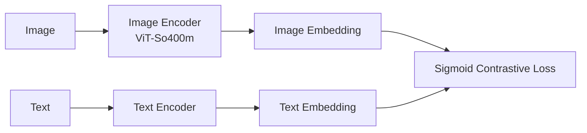
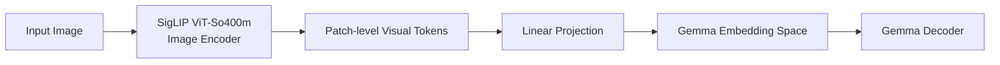
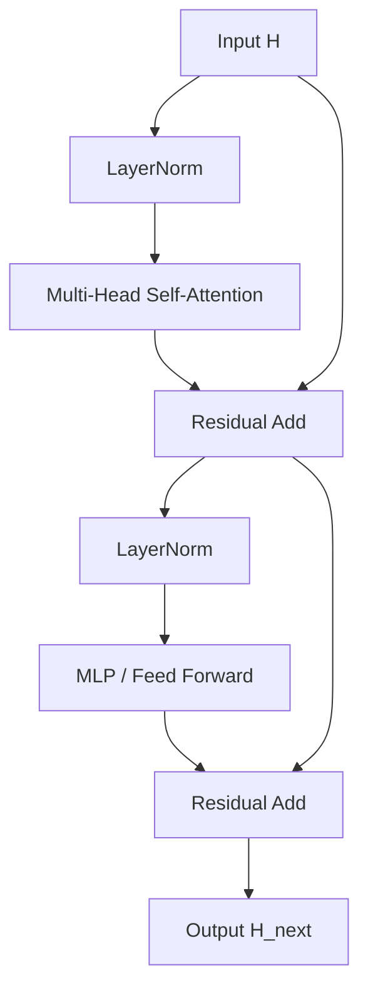
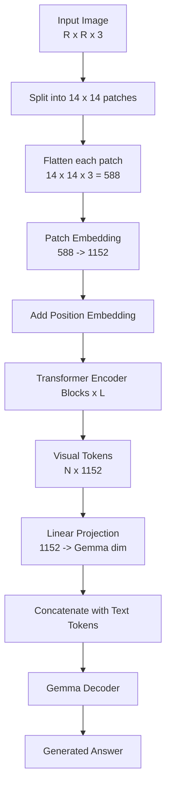

> 参考：[[libs/biblib/beyerpaligemma2024/beyerpaligemma2024.pdf|PaliGemma: A versatile 3B VLM for transfer]] 中使用 SigLIP ViT-So400m 作为图像编码器。这里整理的是它作为 **ViT 图像编码器** 时，从输入图像到 visual tokens 的计算过程。

## 1. 整体结构

SigLIP 本身是一个类似 CLIP 的图文双塔模型：

但在 PaliGemma 中，只使用 SigLIP 的 **图像编码器**，不使用它的文本编码器：

---

## 2. 输入与预处理

设原始图像为：

$$
X \in \mathbb{R}^{H \times W \times 3}
$$

在 PaliGemma 中，图像会被 resize 成固定正方形分辨率：

$$
R \times R
$$

常见版本包括：

| 分辨率 | patch size | patch 网格 | visual tokens 数量 |
|---|---:|---:|---:|
| $224 \times 224$ | $14 \times 14$ | $16 \times 16$ | $256$ |
| $448 \times 448$ | $14 \times 14$ | $32 \times 32$ | $1024$ |
| $896 \times 896$ | $14 \times 14$ | $64 \times 64$ | $4096$ |

因此，若 patch size 为：

$$
P = 14
$$

则 patch 数量为：

$$
N = \frac{R}{P} \times \frac{R}{P}
$$

---

## 3. Patch 切分

输入图像被切成互不重叠的 patch。

每个 patch 的形状是：

$$
P \times P \times 3 = 14 \times 14 \times 3
$$

展平后，每个 patch 是一个向量：

$$
x_i \in \mathbb{R}^{P^2 \cdot 3}
$$

当 $P=14$ 时：

$$
P^2 \cdot 3 = 14 \times 14 \times 3 = 588
$$

所以：

$$
x_i \in \mathbb{R}^{588}
$$

---

## 4. Patch Embedding

每个 patch 会被线性映射到 ViT 的 hidden dimension。

设 ViT hidden size 为：

$$
D = 1152
$$

则 patch embedding 的计算为：

$$
z_i = x_i W_{patch} + b_{patch}
$$

其中：

$$
W_{patch} \in \mathbb{R}^{588 \times 1152}
$$

$$
b_{patch} \in \mathbb{R}^{1152}
$$

因此：

$$
z_i \in \mathbb{R}^{1152}
$$

对所有 patch 做完 embedding 后，得到：

$$
Z = [z_1, z_2, \dots, z_N]
$$

$$
Z \in \mathbb{R}^{N \times D}
$$

实际实现中，这一步通常等价于一个卷积层：

$$
\operatorname{Conv2d}(C_{in}=3, C_{out}=D, K=P, S=P)
$$

也就是：

$$
\operatorname{Conv2d}(3, 1152, \text{kernel}=14, \text{stride}=14)
$$

这个卷积的作用是：

1. 每次看一个 $14 \times 14$ patch；
2. stride 也是 $14$，所以 patch 之间不重叠；
3. 输出通道数是 $1152$，即每个 patch 被映射成一个 $1152$ 维 token。

---

## 5. 加位置编码

Transformer 本身不包含二维空间顺序信息，因此需要给每个 patch token 加位置编码。

设第 $i$ 个 patch 的位置编码为：

$$
p_i \in \mathbb{R}^{D}
$$

则输入 Transformer 前的 token 为：

$$
h_i^{(0)} = z_i + p_i
$$

整体写作：

$$
H^{(0)} = Z + P_{pos}
$$

其中：

$$
H^{(0)} \in \mathbb{R}^{N \times D}
$$

例如 $224 \times 224$ 输入时：

$$
H^{(0)} \in \mathbb{R}^{256 \times 1152}
$$

---

## 6. Transformer Encoder 主体

SigLIP ViT-So400m 的图像编码器主体是多层 Transformer Encoder。每一层的结构可以写成：

数学形式是：

$$
\tilde{H}^{(l)} = H^{(l)} + \operatorname{MSA}(\operatorname{LN}(H^{(l)}))
$$

$$
H^{(l+1)} = \tilde{H}^{(l)} + \operatorname{MLP}(\operatorname{LN}(\tilde{H}^{(l)}))
$$

其中 $l$ 表示第 $l$ 层 Transformer block。

---

## 7. Multi-Head Self-Attention 计算过程

设某一层输入为：

$$
H \in \mathbb{R}^{N \times D}
$$

先做 LayerNorm：

$$
U = \operatorname{LN}(H)
$$

然后分别计算 Query、Key、Value：

$$
Q = U W_Q
$$

$$
K = U W_K
$$

$$
V = U W_V
$$

其中：

$$
Q, K, V \in \mathbb{R}^{N \times D}
$$

### 7.1 分成多个 head

设 attention head 数为：

$$
h = 16
$$

则每个 head 的维度为：

$$
d_h = \frac{D}{h} = \frac{1152}{16} = 72
$$

对第 $j$ 个 head，有：

$$
Q_j, K_j, V_j \in \mathbb{R}^{N \times d_h}
$$

### 7.2 单个 head 的 attention

单个 head 的 attention score 为：

$$
S_j = \frac{Q_j K_j^\top}{\sqrt{d_h}}
$$

其中：

$$
S_j \in \mathbb{R}^{N \times N}
$$

然后对每一行做 softmax：

$$
A_j = \operatorname{softmax}(S_j)
$$

再用 attention 权重加权 Value：

$$
O_j = A_j V_j
$$

其中：

$$
O_j \in \mathbb{R}^{N \times d_h}
$$

### 7.3 拼接所有 heads

将所有 head 的输出拼接：

$$
O = \operatorname{Concat}(O_1, O_2, \dots, O_h)
$$

$$
O \in \mathbb{R}^{N \times D}
$$

最后经过输出投影：

$$
\operatorname{MSA}(U) = O W_O
$$

其中：

$$
W_O \in \mathbb{R}^{D \times D}
$$

再加残差连接：

$$
H' = H + \operatorname{MSA}(\operatorname{LN}(H))
$$

---

## 8. MLP / Feed Forward 计算过程

Attention 之后进入 MLP。

先做 LayerNorm：

$$
U' = \operatorname{LN}(H')
$$

MLP 通常是两层线性层，中间接非线性激活：

$$
\operatorname{MLP}(U') = W_2 \sigma(U' W_1 + b_1) + b_2
$$

对于 SigLIP ViT-So400m，可近似理解为：

$$
W_1: 1152 \rightarrow 4304
$$

$$
W_2: 4304 \rightarrow 1152
$$

其中 $\sigma$ 通常是 GELU 或其变体。

最后做残差连接：

$$
H_{next} = H' + \operatorname{MLP}(\operatorname{LN}(H'))
$$

---

## 9. 重复多层 Transformer

假设共有 $L$ 层 Transformer block，则完整计算为：

$$
H^{(0)} \rightarrow H^{(1)} \rightarrow H^{(2)} \rightarrow \dots \rightarrow H^{(L)}
$$

SigLIP ViT-So400m 通常可理解为约：

$$
L = 27
$$

最终输出是：

$$
H^{(L)} \in \mathbb{R}^{N \times D}
$$

即一串 patch-level visual tokens。

---

## 10. 输出到 PaliGemma

在 PaliGemma 中，SigLIP 输出的 visual tokens 会经过一个线性投影层，映射到 Gemma 的 token embedding 空间。

设 Gemma 的 embedding dimension 为 $D_g$，则：

$$
V_{img} = H^{(L)} W_{proj} + b_{proj}
$$

其中：

$$
W_{proj} \in \mathbb{R}^{D \times D_g}
$$

输出：

$$
V_{img} \in \mathbb{R}^{N \times D_g}
$$

然后与文本 token 拼接：

$$
[\text{image tokens}, \text{BOS}, \text{prompt tokens}, \text{SEP}, \text{answer tokens}]
$$

送入 Gemma decoder 做自回归生成。

---

## 11. 从图像到答案的完整流程

---

## 12. 形状例子：224 分辨率

当输入为 $224 \times 224$ 时：

$$
R = 224, \quad P = 14
$$

patch 网格大小：

$$
\frac{224}{14} \times \frac{224}{14} = 16 \times 16
$$

patch 数量：

$$
N = 256
$$

每个 patch 展平：

$$
x_i \in \mathbb{R}^{588}
$$

patch embedding 后：

$$
z_i \in \mathbb{R}^{1152}
$$

所有 patch token：

$$
H^{(0)} \in \mathbb{R}^{256 \times 1152}
$$

经过 Transformer 后：

$$
H^{(L)} \in \mathbb{R}^{256 \times 1152}
$$

投影到 Gemma 后：

$$
V_{img} \in \mathbb{R}^{256 \times D_g}
$$

---

## 13. 核心公式速记

Patch embedding：

$$
z_i = x_i W_{patch} + b_{patch}
$$

加位置编码：

$$
H^{(0)} = Z + P_{pos}
$$

Self-attention：

$$
Q = U W_Q, \quad K = U W_K, \quad V = U W_V
$$

$$
A = \operatorname{softmax}\left(\frac{QK^\top}{\sqrt{d_h}}\right)
$$

$$
O = AV
$$

Transformer block：

$$
\tilde{H}^{(l)} = H^{(l)} + \operatorname{MSA}(\operatorname{LN}(H^{(l)}))
$$

$$
H^{(l+1)} = \tilde{H}^{(l)} + \operatorname{MLP}(\operatorname{LN}(\tilde{H}^{(l)}))
$$

PaliGemma projection：

$$
V_{img} = H^{(L)} W_{proj} + b_{proj}
$$

---

## 14. 与 CLIP / SigLIP 训练目标的关系

SigLIP 和 CLIP 的结构都属于图文双塔模型，但训练目标不同。

CLIP 常用 batch 内 softmax contrastive loss；SigLIP 使用 sigmoid loss，把每个图文对看作一个二分类样本：

$$
y_{ij} \in \{0, 1\}
$$

$$
p_{ij} = \sigma(s_{ij})
$$

其中 $s_{ij}$ 是第 $i$ 张图像和第 $j$ 段文本的相似度分数。

二分类损失可写成：

$$
\mathcal{L}_{ij} = - y_{ij} \log p_{ij} - (1-y_{ij}) \log(1-p_{ij})
$$

不过在 PaliGemma 中，我们关心的是已经训练好的 SigLIP **图像编码器**：

$$
X \mapsto H^{(L)}
$$

也就是把图像转换成一串 patch-level visual tokens，供 Gemma 语言模型使用。
