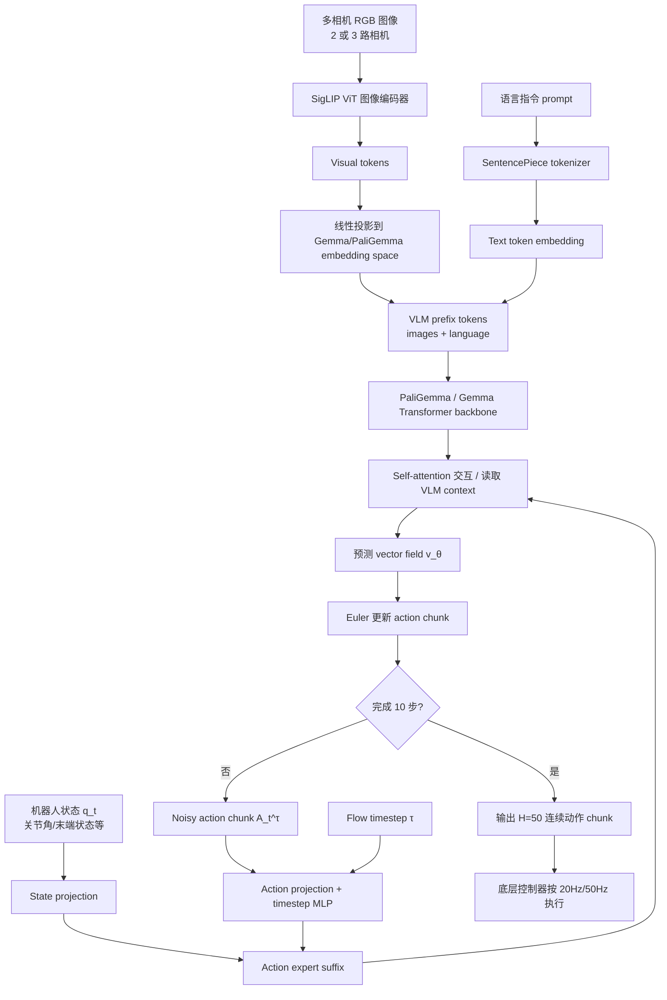
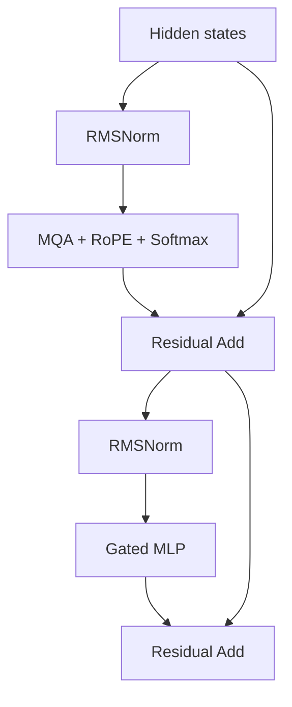

# π0 推理架构分析汇报

> 汇报目标：说明 π0 作为 Vision-Language-Action（VLA）模型的推理链路、关键模块、计算热点，以及为什么本项目应采用“模块级近似计算 + FPGA kernel 验证”的路线，而不是完整部署 π0。

---

## 0. 一句话结论

π0 不是传统的“图像 + 文本 → 文本”的 VLM，而是一个“多相机图像 + 语言指令 + 机器人状态 → 连续动作序列”的 VLA 模型。它以 PaliGemma 作为视觉语言 backbone，在此基础上加入 action expert，并用 flow matching 从随机噪声中迭代生成一个未来动作 chunk。完整模型约 3.3B 参数，推理中包含图像编码、Transformer backbone、action expert 和 10 步 flow denoising，因此不适合直接整体搬到资源受限 FPGA；更合理的研究切入点是对 Linear/GEMM、attention softmax、MLP 激活、RMSNorm、projector 和 action expert 子模块做近似计算优化。

---

## 1. π0 的模型定位：从 VLM 到 VLA

### 1.1 传统 VLM 与 π0 的区别

传统 VLM 通常处理：

```text
图像 + 文本问题 → 文本答案
```

π0 处理的是机器人控制问题：

```text
多相机图像 + 语言指令 + 机器人本体状态 → 连续控制动作
```

因此，π0 的输出不是自然语言 token，而是一个连续动作 chunk：

$$
A_t = [a_t, a_{t+1}, \dots, a_{t+H-1}]
$$

其中论文中使用的动作 horizon 为：

$$
H = 50
$$

这意味着 π0 一次推理生成未来 50 个低层控制动作，而不是只输出当前时刻的一个动作。

### 1.2 为什么要基于 PaliGemma？

π0 继承 PaliGemma 的视觉语言理解能力。PaliGemma 本身由三部分组成：

1. SigLIP ViT-So400m 图像编码器；
2. Gemma-2B decoder-only 语言模型；
3. SigLIP visual tokens 到 Gemma embedding space 的线性投影层。

参考：[[PORJECTS/PI0近似计算/资料/论文/@beyerpaligemma2024 - PaliGemma_ A versatile 3B VLM for transfer|PaliGemma论文笔记]]、[[PORJECTS/PI0近似计算/整理/模型架构/SigLIP ViT-So400m|SigLIP ViT-So400m]]、[[PORJECTS/PI0近似计算/整理/模型架构/Gemma-2B|Gemma-2B]]。

在机器人任务中，语言指令往往包含大量语义信息，例如“把叉子拿起来”“折叠毛巾”“把垃圾放进垃圾桶”。这些任务不只是低维控制问题，还需要理解物体、场景和指令。因此 π0 使用预训练 VLM backbone 获得视觉语言语义能力，再通过机器人数据训练出动作生成能力。

---

## 2. π0 整体推理链路

### 2.1 总体流程图



### 2.2 输入与输出

| 类别 | 内容 | 说明 |
|---|---|---|
| 图像输入 | $I_t^1, \dots, I_t^n$ | 论文中通常为 2 或 3 个 RGB 相机视角；openpi 默认输入规范包含 `base_0_rgb`、`left_wrist_0_rgb`、`right_wrist_0_rgb` 三路图像 |
| 语言输入 | $\ell_t$ | 自然语言任务指令，经 tokenizer 转换为文本 token |
| 状态输入 | $q_t$ | 机器人本体状态，例如关节角；openpi 默认 `action_dim=32`，state 也按该维度进入配置 |
| 噪声动作 | $A_t^\tau$ | flow matching 当前步的 noisy action chunk |
| 输出 | $A_t$ | 未来 $H=50$ 步连续动作序列 |

在 openpi 当前源码中，默认图像分辨率为：

$$
224 \times 224
$$

SigLIP patch size 为 14 时，每张图像约产生：

$$
\frac{224}{14} \times \frac{224}{14} = 16 \times 16 = 256
$$

个 visual tokens。若使用三路相机，则图像 token 约为：

$$
3 \times 256 = 768
$$

再加上文本 prompt token。openpi 的 π0 默认 `max_token_len=48`，因此一个典型 prefix 长度约为：

$$
768 + 48 = 816
$$

suffix 部分包括 1 个 state token 和 50 个 action tokens，约为：

$$
1 + 50 = 51
$$

> 注：以上 shape 是基于 openpi 当前默认配置的工程化估算，用于分析计算量和 FPGA 瓶颈；不同 checkpoint、机器人平台和数据 transform 可能略有差异。

---

## 3. π0 的核心模块拆解

### 3.1 图像编码器：SigLIP ViT-So400m

图像编码器负责把 RGB 图像转换成 patch-level visual tokens。

以 $224 \times 224$ 输入为例：

1. 图像被切成 $14 \times 14$ patch；
2. 每个 patch 展平为 $14 \times 14 \times 3 = 588$ 维向量；
3. patch embedding 投影到 ViT hidden dimension；
4. 多层 Transformer Encoder 处理所有 patch tokens；
5. 输出一组 visual tokens。

主要计算包括：

- patch embedding / Conv2D；
- ViT self-attention；
- attention softmax；
- MLP / FFN；
- LayerNorm；
- residual add。

这些模块本质上以矩阵乘法和非线性函数为主，是后续近似计算的重要对象。

### 3.2 视觉-语言 backbone：PaliGemma / Gemma-2B

PaliGemma 的结构可简化为：

```text
SigLIP visual tokens → Linear projection → Gemma embedding space
Text tokens → Gemma token embedding
拼接 image tokens + text tokens → Gemma decoder
```

Gemma-2B 的重要结构特征包括：

| 模块 | 特征 | 对硬件的影响 |
|---|---|---|
| Decoder-only Transformer | 18 层左右 | 层数多，重复 GEMM 多 |
| hidden size | 2048 | 激活和权重矩阵大 |
| MQA | 多个 query heads 共享 KV | 降低 KV cache，但 Q/K/V 仍有大量线性计算 |
| RMSNorm | 不减均值，只按 RMS 归一化 | 比 LayerNorm 简单，但仍需平方、求和、倒平方根 |
| RoPE | 在 Q/K 上注入位置信息 | 需要 sin/cos 或预计算表 |
| gated MLP | gate/up/down 三组大矩阵 | MLP 是主要计算热点 |

Gemma block 可概括为：



### 3.3 Action expert

π0 的关键改动是：在 PaliGemma 的 VLM backbone 之外增加一个较小的 action expert，用于处理机器人状态和动作 token。

论文和 openpi 源码中的主要设计是：

1. image/language tokens 走较大的 VLM backbone；
2. state/action tokens 走较小的 action expert；
3. 两组权重只通过 self-attention 交互；
4. action expert 对每个 noisy action token 输出一个 denoising vector；
5. 输出经线性层投影回动作维度。

openpi 默认配置中：

| 组件 | 配置 |
|---|---:|
| VLM backbone variant | `gemma_2b` |
| action expert variant | `gemma_300m` |
| VLM width | 2048 |
| action expert width | 1024 |
| depth | 18 |
| action expert MLP dim | 4096 |
| num heads | 8 |
| num KV heads | 1 |
| head dim | 256 |
| action horizon | 50 |
| action dim | 32 |

因此，π0 不是简单地“PaliGemma 输出一段文字，再把文字转动作”，而是在同一个 Transformer 式结构中，让 action tokens 通过 attention 读取 image/language context，并直接输出连续动作方向场。

---

## 4. Flow matching 推理机制

### 4.1 训练时学什么？

训练时，给定真实动作 chunk：

$$
A_t = [a_t, a_{t+1}, \dots, a_{t+H-1}]
$$

采样高斯噪声：

$$
\epsilon \sim \mathcal{N}(0, I)
$$

构造 noisy action：

$$
A_t^\tau = \tau A_t + (1-\tau)\epsilon
$$

模型学习预测从 noisy action 指向真实动作的 vector field：

$$
v_\theta(A_t^\tau, o_t)
$$

也就是说，action expert 学到的不是“直接预测动作”，而是“当前 noisy action 应该往哪个方向移动，才能变成合理动作”。

### 4.2 推理时怎么生成动作？

推理时没有真实动作，模型从随机噪声开始：

$$
A_t^0 \sim \mathcal{N}(0, I)
$$

然后使用 Euler 积分逐步更新：

$$
A_t^{\tau+\delta} = A_t^\tau + \delta v_\theta(A_t^\tau, o_t)
$$

论文实验使用 10 个 integration steps，步长约为：

$$
\delta = 0.1
$$

因此推理可以理解为：

```text
随机动作 chunk
    ↓ 第 1 步 denoise
较合理的动作 chunk
    ↓ 第 2 步 denoise
更合理的动作 chunk
    ↓ ...
    ↓ 第 10 步 denoise
最终 H=50 连续动作 chunk
```

openpi 源码采用扩散模型中更常见的时间约定：`t=1` 表示噪声，`t=0` 表示目标动作，因此代码中更新形式为：

$$
dt = -\frac{1}{\text{num\_steps}}, \quad x_t \leftarrow x_t + dt \cdot v_t
$$

这与论文从 $\tau=0$ 积分到 $\tau=1$ 的描述方向相反，但本质上是同一个去噪积分过程。

---

## 5. 推理阶段的 attention mask 与 KV cache

π0 的输入序列可以分成三个 block：

```text
Block 1: [images, language]
Block 2: [state]
Block 3: [noisy actions]
```

attention 规则是 blockwise causal：

| 查询 token | 可关注内容 | 设计目的 |
|---|---|---|
| image/language tokens | image/language block 内部 | 尽量保持 PaliGemma 预训练分布 |
| state token | image/language + state | state 不看 action，便于缓存和稳定 |
| action tokens | image/language + state + 所有 action tokens | action expert 读取完整观测条件并建模动作间关系 |

这个设计非常重要：

1. VLM backbone 不需要读取未来的 state/action tokens，减少分布偏移；
2. action tokens 可以读取图像、语言、状态和其他 action tokens；
3. action chunk 内部是双向建模，不是自回归逐动作生成；
4. 推理时 image/language prefix 的 KV 可以缓存，10 步 flow 中主要重复计算 action suffix。

openpi 当前源码中的推理流程是：

```text
1. preprocess observation
2. embed_prefix(images + language)
3. 对 prefix 做一次 forward，生成 KV cache
4. 初始化 x_t = Gaussian noise
5. for step in 10 denoising steps:
      a. embed_suffix(state + noisy action + timestep)
      b. suffix attention 读取 prefix KV cache
      c. action_out_proj 得到 v_t
      d. Euler 更新 x_t
6. 返回最终 action chunk
```

这说明推理优化重点不只是图像编码器和 VLM backbone，还包括被重复调用 10 次的 action expert suffix forward。

---

## 6. 推理耗时与计算瓶颈

π0 论文在 RTX 4090 上给出了三相机输入的推理耗时拆分：

| 模块 | 耗时 |
|---|---:|
| image encoders | 14 ms |
| observation forward pass | 32 ms |
| 10 次 action forward pass / flow | 27 ms |
| network latency，如果 off-board | 13 ms |
| total on-board inference | 73 ms |
| total off-board inference | 86 ms |

这个表说明：

1. 图像编码不是唯一瓶颈；
2. VLM observation forward 很重；
3. action expert 单次不一定最重，但由于 flow matching 要重复 10 次，总开销很明显；
4. 端到端推理不是每 20 ms 跑一次完整模型。

### 6.1 50Hz 的正确理解

π0 论文中提到机器人可以以最高 50Hz 控制，但这不是说完整 VLM 模型每 20ms 推理一次。

正确理解是：

1. 模型一次生成 $H=50$ 的 action chunk；
2. 底层控制器按 20Hz 或 50Hz 执行动作；
3. 对 50Hz 机器人，论文中每 0.5s 重新推理一次，即执行 25 个动作后再更新；
4. 因此完整 π0 推理频率远低于底层动作执行频率。

---

## 7. 对 FPGA 部署的影响

### 7.1 为什么不适合完整部署？

完整 π0 直接部署到资源受限 FPGA 面临以下问题：

| 瓶颈 | 原因 |
|---|---|
| 参数量过大 | PaliGemma backbone 约 3B 级别，action expert 约 300M 级别 |
| 片上存储不足 | 权重无法完整放入 BRAM/URAM，需要频繁访存 |
| GEMM 密集 | Transformer 中 Q/K/V、output projection、MLP 都是大矩阵乘法 |
| attention softmax 复杂 | 需要指数、归一化、mask，硬件实现成本高 |
| 非线性函数多 | GELU/Swish、RMSNorm、RoPE 都涉及非线性或特殊函数 |
| flow 迭代重复 | action expert 需要重复运行 10 次 |
| 多相机输入 | 图像 token 数量随相机数和分辨率增长 |
| 实时性要求高 | 机器人控制对 latency 和稳定性敏感 |

因此，本项目不应声称“完整 π0 上 FPGA”，而应表述为：

> 针对 π0 推理链路中的关键算子和子模块进行近似计算与 FPGA kernel 验证，为未来 VLA 模型的边缘端部署提供可行优化方向。

### 7.2 更合理的 FPGA 研究切入点

| 模块 | 主要算子 | 近似计算方向 | 优先级 |
|---|---|---|---:|
| Linear / GEMM | 矩阵乘法 | INT8、W4A8、混合精度、分块矩阵乘 | 高 |
| Visual projector | 1152 → 2048 线性投影 | INT8/INT16 定点化 | 高 |
| Action/state projection | 低维连续状态到 embedding | 定点线性层 | 高 |
| Action expert MLP | 大量 Linear + Swish/GELU | INT8 GEMM + LUT/PWL 激活 | 高 |
| Attention softmax | exp + sum + divide | LUT softmax、PWL exp、base-2 softmax | 中高 |
| RMSNorm / LayerNorm | 平方、求和、rsqrt | 定点累加 + 近似倒平方根 | 中 |
| RoPE | sin/cos 旋转 | 查表 sin/cos、CORDIC、预计算 | 中 |
| Flow steps | 10 次迭代 | 减少 step 数，如 10→8→5，对比误差 | 中高 |
| 完整 VLM backbone | 3B 级 Transformer | 不建议完整实现 | 低 |

---

## 8. 面向近似计算的实验设计建议

### 8.1 PyTorch 侧实验

PyTorch 侧不必完整复现 π0，可以构造与 π0 结构相似的代表性模块：

1. Linear/GEMM benchmark；
2. projector benchmark；
3. attention softmax benchmark；
4. RMSNorm benchmark；
5. GELU/Swish 近似 benchmark；
6. 小型 action expert block benchmark；
7. flow step 数量对输出误差的影响。

评价指标：

| 指标 | 含义 |
|---|---|
| MSE / MAE | 近似输出与 FP32 baseline 的误差 |
| cosine similarity | 输出方向是否保持一致 |
| max error | 最坏情况误差 |
| latency | CPU/GPU 或模拟硬件耗时 |
| memory / model size | 量化后存储压缩率 |

### 8.2 Vitis HLS 侧实验

FPGA/HLS 侧建议做小 kernel，而不是完整模型：

1. INT8 Linear kernel；
2. fixed-point projector；
3. LUT/PWL softmax；
4. fixed-point GELU/Swish；
5. RMSNorm 近似；
6. action expert 中的 MLP 子模块。

评价指标：

| 指标 | 说明 |
|---|---|
| Latency | 单次 kernel 延迟 |
| Initiation Interval, II | pipeline 吞吐能力 |
| Fmax | 综合频率 |
| LUT / FF / BRAM / DSP | 资源占用 |
| Numerical error | 与 Python/FP32 baseline 对比 |

---

## 9. 汇报时可用的讲解稿

### 9.1 开场

本次汇报分析 π0 的推理架构，并讨论其在 FPGA 上做近似计算优化的可行切入点。π0 不是普通视觉语言模型，而是 Vision-Language-Action 模型。它输入多相机图像、语言指令和机器人状态，输出未来一段连续动作序列，因此它的推理链路比普通 VLM 更复杂。

### 9.2 架构说明

π0 的基础是 PaliGemma。PaliGemma 由 SigLIP 图像编码器、Gemma-2B 语言模型和一个视觉投影层组成。π0 在 PaliGemma 的基础上加入机器人状态输入和动作输出，并额外设计了 action expert。图像和语言 token 进入 VLM backbone，状态和动作 token 进入 action expert，两部分通过 self-attention 交互。

### 9.3 推理过程说明

推理时，模型先把多相机图像和语言指令编码成 prefix，并缓存其 attention KV。然后从随机噪声初始化一个 action chunk，通过 flow matching 做 10 次 Euler denoising。每一步 action expert 都会根据当前 noisy action、timestep 和观测上下文预测一个 vector field，用来更新整个动作 chunk。最后输出长度为 50 的连续动作序列。

### 9.4 计算瓶颈说明

从论文的 RTX 4090 推理耗时看，图像编码、observation forward 和 10 次 action forward 都有明显开销。Transformer 中的 Linear/GEMM、attention softmax、MLP、RMSNorm、RoPE 和 action expert 重复计算是主要瓶颈。因此，完整 π0 不适合直接部署到资源受限 FPGA。

### 9.5 项目切入点说明

本项目采用模块级近似计算路线：选择 π0 中最典型、最耗时、最适合硬件化的算子，例如 Linear/GEMM、projector、softmax、GELU/Swish、RMSNorm 和 action expert MLP。先在 PyTorch 中比较 FP32、FP16、INT8、INT4 和 LUT/PWL 近似的误差，再在 Vitis HLS 中实现若干定点 kernel，输出 latency、II、Fmax 和资源占用数据。这样既贴合 π0 架构，又能在一周内得到可展示结果。

---

## 10. 可放进 PPT 的核心页

### Slide 1：π0 是什么？

```text
π0 = PaliGemma VLM backbone + action expert + flow matching
输入：多相机图像 + 语言指令 + 机器人状态
输出：H=50 的连续动作 chunk
```

### Slide 2：推理流程

```text
Images/Text/State → VLM context → noisy action → action expert → 10-step Euler denoising → action chunk
```

### Slide 3：为什么难部署？

```text
3B+ 参数、Transformer GEMM 密集、softmax/Norm 非线性、10 次 flow 迭代、多相机 token 数量大
```

### Slide 4：近似计算切入点

```text
INT8/W4A8 Linear
LUT/PWL softmax
fixed-point projector
GELU/Swish 近似
RMSNorm 近似
flow steps 减少
```

### Slide 5：实验计划

```text
PyTorch：误差 + 延迟评估
Vitis HLS：kernel latency + II + Fmax + LUT/FF/BRAM/DSP
目标：证明模块级近似计算可降低计算代价，同时保持输出相似度
```

---

## 11. 事实依据与源码核对

### 11.1 本地论文与笔记

- π0 论文：[[PORJECTS/PI0近似计算/资料/论文/@black02026 - $π_0$_ A Vision-Language-Action Flow Model for General Robot Control|π0论文笔记]]；PDF：[[libs/biblib/black02026/black02026.pdf|black02026.pdf]]
- PaliGemma 论文：[[PORJECTS/PI0近似计算/资料/论文/@beyerpaligemma2024 - PaliGemma_ A versatile 3B VLM for transfer|PaliGemma论文笔记]]；PDF：[[libs/biblib/beyerpaligemma2024/beyerpaligemma2024.pdf|beyerpaligemma2024.pdf]]
- Transformer 基础：[[PORJECTS/PI0近似计算/资料/论文/@vaswaniattention2023 - Attention Is All You Need|Attention Is All You Need]]
- 模型架构整理：[[PORJECTS/PI0近似计算/整理/模型架构/SigLIP ViT-So400m|SigLIP ViT-So400m]]、[[PORJECTS/PI0近似计算/整理/模型架构/Gemma-2B|Gemma-2B]]

### 11.2 openpi 源码核对

本稿额外核对了 openpi 官方 GitHub 仓库当前 main 分支源码，commit：`650c5b0283a49c42784fb5055a0507da2c6d347d`。

关键文件：

- [`src/openpi/models/pi0.py`](https://github.com/Physical-Intelligence/openpi/blob/650c5b0283a49c42784fb5055a0507da2c6d347d/src/openpi/models/pi0.py)：prefix/suffix embedding、attention mask、KV cache、10 步 denoising。
- [`src/openpi/models/pi0_config.py`](https://github.com/Physical-Intelligence/openpi/blob/650c5b0283a49c42784fb5055a0507da2c6d347d/src/openpi/models/pi0_config.py)：`action_dim=32`、`action_horizon=50`、`max_token_len=48`、`gemma_2b` + `gemma_300m` 配置。
- [`src/openpi/models/gemma.py`](https://github.com/Physical-Intelligence/openpi/blob/650c5b0283a49c42784fb5055a0507da2c6d347d/src/openpi/models/gemma.py)：Gemma/action expert 的 width、depth、MLP dim、MQA 配置。
- [`src/openpi/models/model.py`](https://github.com/Physical-Intelligence/openpi/blob/650c5b0283a49c42784fb5055a0507da2c6d347d/src/openpi/models/model.py)：默认三路图像 key 与 $224 \times 224$ 图像分辨率。

---

## 12. 后续 TODO

- [ ] 根据汇报时间压缩成 5 分钟/10 分钟两个版本。
- [ ] 画一张正式架构图，用于 PPT。
- [ ] 补充 [[PORJECTS/PI0近似计算/产出/FPGA部署瓶颈|FPGA部署瓶颈]]。
- [ ] 写近似计算方案：量化、softmax 近似、GELU/Swish 近似、RMSNorm 近似。
- [ ] 建 PyTorch benchmark 表格。
- [ ] 建 Vitis HLS kernel 结果表格。
