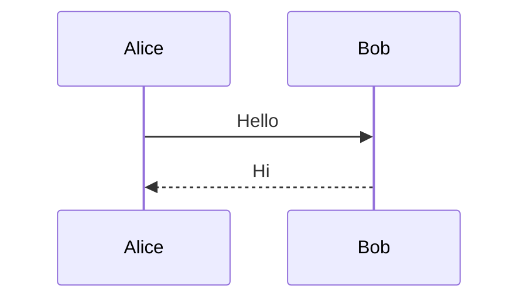

# Slides Extended 使用说明整理

> 根据 Slides Extended 官方文档整理，偏“速查 + 实用模板”，不是逐字翻译。  
> 官方入口：<https://www.ebullient.dev/projects/obsidian-slides-extended/>

## 1. 它是什么

**Slides Extended** 是 Obsidian 的社区插件，用来在 Obsidian 里写 Markdown 幻灯片。它基于 **Reveal.js**，比 Obsidian 内置 Slides 更适合做正式演示。

主要能力：

- 在 Obsidian 中实时预览幻灯片
- 支持主题、代码高亮主题、自定义 CSS / JS
- 支持 Wiki link、Obsidian embed、图片尺寸语法
- 支持 Mermaid、Excalidraw、数学公式、Callout、表格、脚注
- 支持横向 / 纵向幻灯片、动画、Fragments、演讲者备注
- 支持 Split / Grid 排版组件
- 支持模板、嵌入单页幻灯片、插件扩展

---

## 2. 安装与基本设置

### 安装

在 Obsidian 中：

1. 打开 **设置 → 社区插件**
2. 搜索 **Slides Extended**
3. 安装并启用

> 注意：插件会下载用于创建和展示幻灯片的 runtime。如果网络受限，需要允许访问 `github.com`。

### 设置入口

路径：

```text
设置 → 第三方插件 → Slides Extended
```

常见设置：

| 设置 | 作用 |
|---|---|
| Port | 插件运行端口，默认 `3000`；多个 vault 同时使用时可改 |
| Assets directory | 自定义主题、CSS、JS、HTML 模板所在目录 |
| Scripts / Remote Scripts | 给所有演示加载本地或远程 JavaScript |

推荐在 vault 中建一个统一目录：

```text
assets/
  css/
  js/
  html/
```

然后在插件设置里把 **Assets directory** 设为 `assets`。

---

## 3. 最小可用示例

新建一个 Markdown 笔记，写：

```md
# 第一页

这里是封面。

---

## 第二页

- 要点一
- 要点二
```

然后点击工具栏里的 **Show Slide Preview**，或从命令面板打开预览。

---

## 4. 幻灯片分页规则

### 横向分页

使用单独一行的三个短横线：

```md
# Slide 1

---

# Slide 2
```

### 纵向分页

使用单独一行的两个短横线：

```md
# Slide 1

---

# Slide 2.1

--

# Slide 2.2
```

理解方式：

- `---`：下一张横向幻灯片
- `--`：当前横向幻灯片下面的纵向子页

也可以用 frontmatter 自定义分隔符：

```yaml
---
separator: "\\r?\\n---\\r?\\n"
verticalSeparator: "\\r?\\n--\\r?\\n"
---
```

---

## 5. 推荐 frontmatter 模板

```yaml
---
theme: black
highlightTheme: zenburn
width: 1280
height: 720
margin: 0.06
transition: slide
slideNumber: true
controls: true
progress: true
center: true
---
```

常用字段：

| 字段 | 作用 | 常见值 / 默认值 |
|---|---|---|
| `width` | 演示画布宽度 | 默认 `960` |
| `height` | 演示画布高度 | 默认 `700` |
| `margin` | 内容边距 | 默认 `0.04` |
| `theme` | Reveal.js 主题 | 默认 `black` |
| `highlightTheme` | 代码高亮主题 | 默认 `zenburn` |
| `css` | 额外 CSS 文件 | 数组 |
| `transition` | 翻页动画 | `none` / `fade` / `slide` / `convex` / `concave` / `zoom` |
| `transitionSpeed` | 动画速度 | `default` / `fast` / `slow` |
| `slideNumber` | 显示页码 | `true` / `false` / Reveal.js 格式 |
| `controls` | 显示控制箭头 | 默认 `true` |
| `progress` | 显示进度条 | 默认 `true` |
| `center` | 垂直居中 | 默认 `true` |
| `loop` | 循环播放 | 默认 `false` |
| `fragments` | 是否启用渐进显示 | 默认 `true` |
| `showNotes` | 是否公开显示演讲者备注 | 默认 `false` |
| `autoSlide` | 自动翻页间隔，毫秒 | `0` 表示关闭 |
| `bg` | 全局背景 | 颜色 / 图片 / `transparent` |
| `defaultTemplate` | 默认套用模板 | Wiki link |
| `enableChalkboard` | 启用黑板 | `true` / `false` |
| `enableTimeBar` | 启用时间条 | `true` / `false` |
| `timeForPresentation` | 演示时长，秒 | 默认 `120` |

---

## 6. 基础 Markdown 支持

Slides Extended 支持大部分 Obsidian / Markdown 常用语法：

- 标题：`#`、`##`、`###`
- 加粗、斜体、删除线
- 有序 / 无序列表
- 表格
- 引用
- 行内代码和代码块
- 脚注
- 数学公式
- Mermaid 图
- Callout
- Wiki link 与 embed

### 图片

```md
![[Image.jpg]]
![[Image.jpg|300]]
![[Image.jpg|300x100]]

```

如果需要裁切填充，可以加元素样式：

```md
![[Image.jpg|300x100]] <!-- element style="object-fit: cover" -->
```

### 嵌入其他笔记

```md
![[Some Note]]

---

![[Some Note#某个标题]]
```

### 视频

```html
<video data-autoplay controls width="800">
  <source src="Attachments/demo.mp4" type="video/mp4">
</video>
```

### 代码高亮与逐步高亮

````md
```js [1-2|3|4]
let a = 1;
let b = 2;
let c = x => a + b + x;
c(3);
```
````

含义：翻页时先高亮 1-2 行，再高亮第 3 行，最后高亮第 4 行。

### 数学公式

```md
行内公式：$E = mc^2$

块级公式：
$$
\begin{vmatrix}a & b\\ c & d\end{vmatrix}=ad-bc
$$
```

### Mermaid

````md

````

可以在 frontmatter 中配置 Mermaid：

```yaml
---
mermaid:
  theme: forest
  themeVariables:
    fontSize: 32px
---
```

### Callout

```md
> [!tip] 提示
> 这里是提示内容。
```

Callout 也可以结合元素标注或 Grid 调整大小、位置和样式。

---

## 7. 元素标注与页面标注

### 元素标注

给当前元素加 class、style 或属性：

```md
重点文字 <!-- element class="fragment highlight-red" -->

带背景文字 <!-- element style="background: #334155; padding: 0.3em" -->
```

常用于：

- 调整单个元素字体、颜色、对齐方式
- 给列表项加 fragment
- 控制图片大小、旋转、边框等

### 页面标注

给整页幻灯片加属性：

```md
<!-- .slide: style="background-color: #111827;" -->

# 深色背景页
```

也可以使用更短的 slide 写法：

```md
<!-- slide bg="#111827" -->

# 深色背景页
```

---

## 8. Fragments：逐步出现 / 强调

Fragments 用来让元素分步出现或变化。

```md
第一点 <!-- element class="fragment" -->
第二点 <!-- element class="fragment fade-up" -->
第三点 <!-- element class="fragment highlight-red" -->
```

可以指定出现顺序：

```md
- 第三步 <!-- element class="fragment" data-fragment-index="3" -->
- 第一步 <!-- element class="fragment" data-fragment-index="1" -->
- 第二步 <!-- element class="fragment" data-fragment-index="2" -->
```

### 快速 fragmented list

Slides Extended 支持用特殊列表符号自动变成逐步出现：

```md
- 永久显示
+ 第一步出现
+ 第二步出现
+ 第三步出现
```

有序列表也可以：

```md
1. 永久显示
2) 第二步出现
3) 第三步出现
```

---

## 9. Inline Styling：直接写 CSS

可以在幻灯片 Markdown 中直接写 `<style>`：

```md
<style>
:root {
  --r-main-font-size: 26px;
}
.with-border {
  border: 2px solid #38bdf8;
  padding: 0.4em;
}
</style>

这段文字有边框 <!-- element class="with-border" -->
```

也可以通过 frontmatter 加载 CSS 文件：

```yaml
---
css:
  - my-talk.css
  - css/extra.css
---
```

这些文件会从插件设置中的 **Assets directory** 查找。

---

## 10. 背景

### 单页背景色

```md
<!-- slide bg="aquamarine" -->

# 彩色背景页
```

支持：

```md
<!-- slide bg="#ff0000" -->
<!-- slide bg="rgb(70, 70, 255)" -->
<!-- slide bg="hsla(315, 100%, 50%, 1)" -->
```

### 单页图片背景

```md
<!-- slide bg="[[cover.jpg]]" -->

# 图片背景
```

带透明度：

```md
<!-- slide bg="[[cover.jpg]]" data-background-opacity="0.5" -->

# 半透明背景图
```

### 全局背景

```yaml
---
bg: '#0f172a'
---
```

OBS 叠加场景可用透明背景：

```yaml
---
bg: transparent
---
```

---

## 11. 演讲者备注

写法：

```md
## 我的幻灯片

这是观众看到的内容。

note: 这是演讲者备注，观众默认看不到。
- 可以写列表
- 可以放图片
```

使用方式：

1. 打开 Slide Preview
2. 点击右上角 **Open in Browser**
3. 在浏览器中按 `S` 打开 speaker view

可以用 frontmatter 改备注分隔符：

```yaml
---
notesSeparator: "note:"
---
```

---

## 12. 排版组件

### 12.1 Split Component：分栏 / 多列

适合常见左右分栏、三栏、图片矩阵。

#### 等宽分栏

```md
<split even>

左侧内容

中间内容

右侧内容

</split>
```

#### 左右比例

```md
<split left="2" right="1" gap="2">

左侧内容，占 2 份

右侧内容，占 1 份

</split>
```

#### 图片换行网格

```md
<split wrap="3" gap="1">

![[img1.png]]

![[img2.png]]

![[img3.png]]

![[img4.png]]

</split>
```

常用属性：

| 属性 | 作用 |
|---|---|
| `even` | 子元素平均分配宽度 |
| `gap="3"` | 元素之间间距，约等于 `3em` |
| `left="2" right="1"` | 左右比例 |
| `wrap="3"` | 每 3 个元素换一行 |
| `no-margin` | 去掉自动行列间距 |

### 12.2 Grid Component：自由定位

适合做更像 PPT 的自由版式。

基本语法：

```md
<grid drag="60 55" drop="5 10">
这里是一个内容块
</grid>
```

含义：

- `drag="60 55"`：块的宽度 60%、高度 55%
- `drop="5 10"`：从左上角开始，横向 5%、纵向 10% 的位置

也可以使用命名位置：

```md
<grid drag="40 30" drop="topleft">
左上角
</grid>

<grid drag="40 30" drop="right">
右侧
</grid>

<grid drag="80 20" drop="bottom">
底部横幅
</grid>
```

常用命名位置：

```text
center, top, bottom, left, right,
topleft, topright, bottomleft, bottomright
```

常用 Grid 属性：

| 属性 | 作用 | 示例 |
|---|---|---|
| `drag` | 大小 | `drag="60 40"` |
| `drop` | 位置 | `drop="center"` |
| `flow` | 子元素排列方向 | `flow="row"` / `flow="col"` |
| `bg` | 背景色 | `bg="orange"` |
| `border` | 边框 | `border="4px solid white"` |
| `opacity` | 透明度 | `opacity="0.7"` |
| `filter` | CSS filter | `filter="grayscale()"` |
| `rotate` | 旋转角度 | `rotate="-10"` |
| `pad` | 内边距 | `pad="20px"` |
| `align` | 对齐 | `align="left"` / `align="center"` |
| `justify-content` | 分布方式 | `space-between` / `space-evenly` |
| `animate` | 块动画 | `animate="fadeIn faster"` |

示例：

```md
<grid drag="45 60" drop="left" bg="#1e293b" pad="24px" align="left">

## 左侧卡片

- 观点 A
- 观点 B

</grid>

<grid drag="45 60" drop="right" border="2px solid #38bdf8" pad="24px">

![[diagram.png|500]]

</grid>
```

---

## 13. Block Comments：块级分组

用 `::: block` 把一组内容包起来，统一加样式或作为模板变量。

```md
::: block <!-- element style="background:#334155; padding:1em" -->

## 标题

这段内容和标题属于同一个块。

:::
```

也可以嵌套：

```md
::: block
外层内容

::: block
内层内容
:::

:::
```

---

## 14. 模板 Templates

模板适合复用固定版式，比如页脚、标题栏、左右栏。

### 模板文件示例：`tpl-footer.md`

```md
<% content %>

<grid drag="100 6" drop="bottom">
<%? footer %>
</grid>
```

说明：

- `<% content %>`：主体内容，模板必须包含
- `<% footer %>`：必填变量
- `<%? footer %>`：可选变量；没有传入时不显示

### 在幻灯片中使用模板

```md
<!-- slide template="[[tpl-footer]]" -->

# 这一页的主体内容

::: footer
这里是页脚
:::
```

### 全局默认模板

```yaml
---
defaultTemplate: "[[tpl-footer]]"
---
```

---

## 15. 主题、代码高亮、自定义 CSS / JS

### 内置主题

常见内置主题：

```text
black, white, league, beige, sky, night,
serif, simple, solarized, blood, moon,
consult, mattropolis
```

启用主题：

```yaml
---
theme: night
---
```

### 自定义主题

推荐路径：

```text
assets/css/my-theme.css
```

然后：

```yaml
---
theme: my-theme.css
---
```

也支持远程主题：

```yaml
---
theme: https://example.com/theme.css
---
```

### 代码高亮主题

内置：

```text
zenburn, monokai, vs2015
```

```yaml
---
highlightTheme: monokai
---
```

自定义高亮 CSS 文件名建议包含 `highlight` 或 `hljs`：

```yaml
---
highlightTheme: github.highlight.css
---
```

### 额外 CSS

```yaml
---
css:
  - my-talk.css
  - css/extra.css
---
```

### 自定义脚本

```yaml
---
scripts:
  - my-plugin.js
remoteScripts:
  - https://d3js.org/d3.v7.min.js
---
```

本地脚本会从 `assets/js/` 或 `assets/` 查找。

---

## 16. Excalidraw、图标、Emoji、图表

### Excalidraw

```md
![[Sample.excalidraw|500]]

![[Sample.excalidraw]] <!-- element style="width:300px; height:400px" -->
```

注意：需要在 Excalidraw 插件设置中启用 **Auto-Export SVG / PNG**。

### Font Awesome 图标

```md

```

也可以用 HTML：

```html
<i class="fas fa-camera fa-3x"></i>
```

### Emoji shortcode

```md
:smile:
:rocket:
```

如果想在普通阅读模式也获得更完整的自动补全，可配合 Obsidian Emoji Shortcodes 插件。

### Charts

支持两类写法：

1. Obsidian Charts 插件语法
2. Reveal.js Charts 语法

示例：

````md
```chart
type: bar
labels: [Mon, Tue, Wed]
series:
  - title: Demo
    data: [1, 3, 2]
```
````

限制：官方说明中提到 Obsidian Charts 的 Dataview Integration 与 Chart from Table 暂不支持。

---

## 17. 动画

### 页面切换动画

```yaml
---
transition: fade
transitionSpeed: fast
---
```

### Auto-Animate

相邻页面都加 `data-auto-animate`，Reveal.js 会自动把相同元素做过渡动画。

```md
<!-- .slide: data-auto-animate -->
# 标题

---

<!-- .slide: data-auto-animate -->
# 标题
### 副标题
```

### Grid 块动画

```md
<grid drag="40 30" drop="center" animate="fadeIn faster">
逐渐出现的内容块
</grid>
```

常见动画类型包括：`fadeIn`、`fadeOut`、`slideRightIn`、`slideLeftIn`、`slideUpIn`、`slideDownIn`、`scaleUp`、`scaleDown` 等。

---

## 18. 内置扩展插件

Slides Extended 自带若干 Reveal.js 插件能力，但通常需要在 Slides Extended 设置中启用。

| 插件 | 作用 | 快捷键 / 配置 |
|---|---|---|
| Chalkboard | 在幻灯片上手写批注，或打开黑板 | 设置中启用 |
| Elapsed Time Bar | 按演示时长显示时间进度条 | `timeForPresentation`，单位秒 |
| Laser Pointer | 鼠标变激光笔 | 按 `Q` |
| Menu | 侧边菜单，按标题快速跳页 | 设置中启用 |
| Overview | 总览模式 | `Esc` 或 `O` |

时间条示例：

```yaml
---
enableTimeBar: true
timeForPresentation: 900
---
```

---

## 19. 嵌入幻灯片到普通笔记

可以在普通 Obsidian 笔记中嵌入某份演示的某一页：

````md
```slide
{
  slide: [[Presentation]],
  page: 7
}
```
````

如果是横向 + 纵向结构，可以用：

```json
{
  "slide": "[[Presentation]]",
  "page": "3/6"
}
```

含义：第 3 个横向位置下的第 6 个纵向页面。

---

## 20. 常用实战片段

### 20.1 调小整体字体

```md
<style>
:root {
  --r-main-font-size: 26px;
}
.reveal h1 { font-size: 1.8em; }
.reveal h2 { font-size: 1.4em; }
.reveal p,
.reveal li { font-size: 0.85em; }
.reveal pre code { font-size: 0.7em; }
</style>
```

### 20.2 标准 16:9 演示

```yaml
---
width: 1280
height: 720
margin: 0.06
theme: black
---
```

### 20.3 左文右图

```md
<split left="1" right="1" gap="2">

## 核心观点

- 观点一
- 观点二
- 观点三

![[diagram.png|500]]

</split>
```

### 20.4 三张卡片

```md
<split even gap="1">

::: block <!-- element style="background:#1e293b; padding:1em; border-radius:12px" -->
### A
内容 A
:::

::: block <!-- element style="background:#1e293b; padding:1em; border-radius:12px" -->
### B
内容 B
:::

::: block <!-- element style="background:#1e293b; padding:1em; border-radius:12px" -->
### C
内容 C
:::

</split>
```

### 20.5 图片背景 + 半透明文字框

```md
<!-- slide bg="[[cover.jpg]]" data-background-opacity="0.45" -->

<grid drag="70 35" drop="center" bg="rgba(0,0,0,0.65)" pad="28px" border="1px solid rgba(255,255,255,.3)">

# 标题

一句简短说明。

</grid>
```

---

## 21. 常见问题

### 幻灯片字体太大怎么办？

优先改：

```yaml
---
width: 1280
height: 720
margin: 0.06
---
```

再加 CSS：

```css
:root { --r-main-font-size: 26px; }
```

### 为什么 Excalidraw 不显示？

检查 Excalidraw 设置里是否启用 **Auto-Export SVG / PNG**。

### 为什么插件首次使用失败？

检查是否能访问 `github.com`，因为插件会下载展示 runtime。

### 如何给所有演示统一样式？

1. 设置 Assets directory，例如 `assets`
2. 把 CSS 放到 `assets/css/`
3. 在 frontmatter 中引用：

```yaml
---
css:
  - common-slide.css
---
```

或将其设为主题。

---

## 22. 官方资料

- Slides Extended 官方文档：<https://www.ebullient.dev/projects/obsidian-slides-extended/>
- 安装说明：<https://www.ebullient.dev/projects/obsidian-slides-extended/getting-started/installation.html>
- 设置说明：<https://www.ebullient.dev/projects/obsidian-slides-extended/getting-started/settings.html>
- Extended Syntax：<https://www.ebullient.dev/projects/obsidian-slides-extended/extend-syntax/>
- Layouts：<https://www.ebullient.dev/projects/obsidian-slides-extended/layout/>
- Templates：<https://www.ebullient.dev/projects/obsidian-slides-extended/templates/>
- Themes：<https://www.ebullient.dev/projects/obsidian-slides-extended/themes/>
- Frontmatter Options：<https://www.ebullient.dev/projects/obsidian-slides-extended/yaml/>
- Reveal.js 文档：<https://revealjs.com/>
