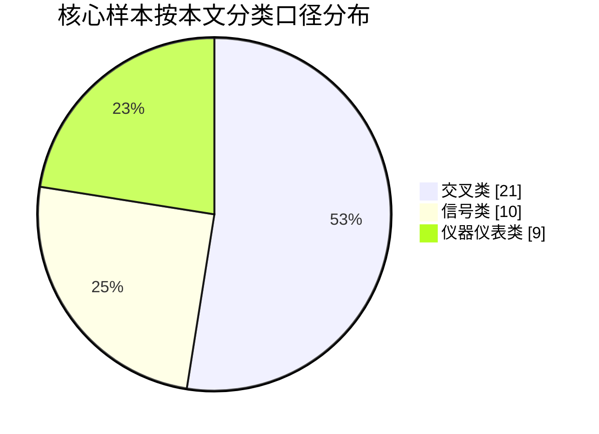

# 全国大学生电子设计竞赛信号仪器仪表FPGA类赛题深度研究报告

## 执行摘要

本报告以可公开访问的历年官方题面、主办方授权培训平台页面，以及可核对的官方题面镜像为基础，整理了 1994—2025 年全国大学生电子设计竞赛中可归入“信号处理 / 仪器仪表 / FPGA”三类或交叉类的核心样本。按本文较严格的分类口径，共纳入 **40 道核心题**；另把 4 道“视觉 / 声学 / 综合感知”边界交叉题放在文末单列说明，不计入主统计。资料来源中，2018 年后官方培训网可直接核对题目与通知；更早历史题面则主要借助保留原始 PDF 的公开镜像交叉核验。citeturn12view0turn10view3turn11view0turn1view0

从主样本统计看，**仪器仪表属性出现 28/40 题，信号属性出现 26/40 题，带有明显 FPGA / 高速时序并行需求的题目有 12/40 题**。命题演变大致经历了四个阶段：早期以“频率计、信号源、LCR/多用表”这类单功能仪器为主；中期进入“示波器、逻辑分析仪、频谱仪、眼图、幅频特性测试”等高速采样与并行处理阶段；近年进一步转向“调制识别、混合传输、线缆/TDR、系统辨识、黑盒建模”等系统级信号链问题；2025 年又明显强化了“自动化、一键完成、参数识别、工程可测性”的考核风格。相关趋势可直接从 2021、2023、2025 多道题的一键启动、全自动测量、时限、误差和不可人工干预条款中看到。citeturn40view0turn15view0turn17view0turn43view0turn44view0turn44view1

对 2026 的判断必须区分赛制：**2026 不是常规奇数年全国总赛年份，而是专题赛 / 赛区赛年份**。官方已明确：2026 模拟电子系统设计专题赛初赛与双数年省赛合并举行，决赛命题主题围绕“模拟信号产生、获取、转换、处理，及变流技术”，且 **初赛题目不少于 7 道，其中至少有 1 道指定使用 TI MSPM0 系列处理器**；决赛现场处理器平台包括 MSPM0G3507、MSPM0L1306、MSP-EXP430F5529LP 和 LAUNCHXL-F280049C。与此同时，2026 还并行设置嵌入式 AI、信息科技前沿等专题赛，说明“基础模拟/信号链能力 + 轻量智能处理”的方向正在加强。citeturn10view3turn11view0turn9view0turn9view1

因此，若以 2026 备战为目标，最高收益的准备路线不是追逐单一热门板卡，而是把能力拆成五条稳定主线：**时基与计数、ADC/DAC 与采样重建、模拟前端与滤波、射频/调制解调、自动测试与标定**。在此基础上，再补一条 2026 明确加权的 **TI MSPM0 / MSP430 / C2000** 训练线，以及一条可选的 **FPGA 高速时序/缓存/触发** 训练线。citeturn11view0turn8view0turn8view1turn9view0

## 资料范围与分类方法

本报告的资料层级分为三层。第一层是官方培训网及其公开通知、题目集合页，用于确认 2023、2025 题目标题以及 2026 赛制与指定器件信息；第二层是可打开并读取文字层的历年题面 PDF；第三层是保存这些题面的公开镜像，用来补齐当前官方导航页难以直接访问的 1994—2017 历史题面。由于早期官方站的历史链接并不总能稳定访问，报告对“官方可直接访问”与“公开镜像可核对原始 PDF”做了区分。citeturn12view0turn10view3turn11view0turn1view0

本文使用的分类标准如下。**信号处理类**，指题目核心目标是波形生成、采样、识别、估计、调制、解调、分离、滤波、回放或同步；**仪器仪表类**，指作品本质上是用于测量元件、电路、链路、参数或特性的仪器；**FPGA 类**，指题目虽然未必明写 FPGA，但实现上明显存在高速采样、并行时序、触发缓存、协议定时、眼图/逻辑分析等对 FPGA 有显著优势的需求。由此会产生“交叉类”，例如“仪器 × FPGA”或“信号 × 仪器 × FPGA”。这一口径刻意排除了明显偏电源、运动控制、机械执行、纯控制系统的题目。citeturn25view1turn22view1turn28view0turn15view0

“评分要素”的处理方式也需要说明。公开题面通常会给出 **设计报告 20 分 + 基本要求 50 分 + 发挥部分 50 分** 的结构，或者早期“报告 / 实物 / 发挥部分”的分值结构；但并不会公开到评委口头细则那样的最细分评分单。因此，本文把“评分要素”界定为 **题面中可直接量化、现场会被检查的功能项与指标项**，同时保留题面给出的公开分值框架。这个口径与 2023 C、2025 D、2025 G 等题公开 PDF 的格式一致。citeturn44view0turn15view0turn17view0

为便于总表阅读，后文把常见方案族记为 8 类：**F1 计数计时**、**F2 DDS/扫频信号源**、**F3 示波/逻辑分析/采样回放**、**F4 频谱/THD/调制识别/信号分离**、**F5 元件与电路参数测试**、**F6 链路/眼图/TDR/网络同步**、**F7 无线收发/自动接收**、**F8 建模/自适应滤波/特性推断**。这些方案族不是官方分类，而是从题面要求与近年官方培训资源内容中总结出的工程实现簇。官方培训网公开课程中已经把“测量与信号类”“仪器仪表类”“元件参数测量”“赛题解析与技术交流研讨会”作为重点训练对象，这与本文的方案族划分基本一致。citeturn8view0turn8view1turn9view0

## 历年题目总表

**核心样本总表采用严格口径，共 40 题。**

| 年份 | 题目 | 分类 | 题面与评分要点摘要 | 难点与考察知识点 | 常见方案族 | 来源 |
|---|---|---|---|---|---|---|
| 1994 | 多路数据采集系统 | 仪器×信号 | 8 路模拟量采集、8 位 A/D、串行远传、循环/选通显示；评分按报告/实作/发挥分开给分 | 多路复用、并串变换、远传时序、抗干扰 | F6 | 题面 citeturn19view0 |
| 1995 | 实用信号源的设计和制作 | 信号 | 正弦+脉冲双输出，20Hz–20kHz，5Hz 步进，频稳、失真、占空比、数显 | 低失真正弦源、可编程脉冲、频率预置 | F2 | 题面 citeturn19view1 |
| 1995 | 简易电阻、电容和电感测试仪 | 仪器 | R/C/L 三参数测量，±5%，4 位显示；发挥看扩量程、提精度、自动量程 | 桥法/时常法、量程切换、校准 | F5 | 题面 citeturn47view0 |
| 1997 | 简易数字频率计 | 仪器 | 频率、周期、脉宽测量，自校时标，测量误差目标明显 | 互易计数、时基稳定度、小信号整形 | F1 | 题面 citeturn19view2 |
| 1999 | 数字式工频有效值多用表 | 仪器×信号 | 工频电压、电流、有功/无功、功率因数，多参数同机测量 | RMS、功率计算、基波/谐波、量程切换 | F5 | 题面 citeturn19view3 |
| 1999 | 频率特性测试仪 | 仪器×信号 | 幅频测试 100Hz–100kHz，自动扫频、打印；发挥做相频测试 | 扫频源、检波、幅/相特性标定 | F2 / F8 | 题面 citeturn20view0 |
| 2001 | 波形发生器 | 信号 | 正弦/方波/三角波 + 用户编辑波形，存储、幅值步进、频率扩展 | 任意波合成、DAC 重构、掉电保存 | F2 | 题面 citeturn20view2 |
| 2001 | 简易数字存储示波器 | 仪器×FPGA | 单次触发采样存储显示，速度档、灵敏度档、触发电平 | 采样率/存储深度折中、触发、显示映射 | F3 | 题面 citeturn20view3 |
| 2001 | 数据采集与传输系统 | 信号×仪器 | 8 路直流采集，经模拟信道调制传输，接收显示；发挥引入伪随机噪声和误码测试 | A/D、调制解调、噪声/误码、同步 | F6 | 题面 citeturn21view0 |
| 2003 | 低频数字式相位测量仪 | 仪器×信号 | 相位仪 + 数字移相信号源 + 移相网络；看相位误差、分辨率、频率显示 | 过零/相敏检测、移相网络、校准 | F1 / F5 | 题面 citeturn22view0 |
| 2003 | 简易逻辑分析仪 | 仪器×FPGA | 8 路逻辑采集、单/三级触发、门限可调、存储显示 | 并行采样、触发状态机、波形缓存 | F3 | 题面 citeturn22view1 |
| 2005 | 正弦信号发生器 | 信号 | 1kHz–10MHz、100Hz 步进、频稳、50Ω 负载；发挥做 AM/FM/ASK/PSK | 高频本振/DDS、RF 输出级、调制 | F2 / F7 | 题面 citeturn23view0 |
| 2005 | 集成运放参数测试仪 | 仪器 | 测 VIO/IIO/AVD/KCMR，发挥加 BWG 与自动量程/自动测量 | 标准测试法、扫频、误差传播、标定 | F5 | 题面 citeturn23view1 |
| 2005 | 简易频谱分析仪 | 仪器×FPGA | 外差式 10–30MHz 频谱分析；发挥识别 AM/FM/等幅波 | 本振扫描、混频、滤波、频谱显示 | F4 | 题面 citeturn24view0 |
| 2007 | 音频信号分析仪 | 信号×仪器×FPGA | 频率成分分析、总功率/分量功率、周期性判断、失真度 | FFT/Goertzel、窗函数、功率谱校准 | F4 | 题面 citeturn25view0 |
| 2007 | 数字示波器 | 仪器×FPGA | 实时采样 + 等效采样，10Hz–10MHz，扫描速度与触发 | 取样保持、等效采样、缓存与显示 | F3 | 题面 citeturn25view1 |
| 2007 | 程控滤波器 | 信号 | 增益可设，低通/高通截止频率设置；发挥做椭圆低通与简易扫频仪 | 有源滤波器设计、程控电阻/电容、扫频测量 | F8 | 题面 citeturn26view0 |
| 2007 | 积分式直流数字电压表 | 仪器 | 禁用专用 ADC，考察积分型直流数字表、工频抑制、自动校零/量程 | 双积分/多积分 A/D、工频陷波、参考稳定度 | F5 | 题面 citeturn26view1 |
| 2007 | 信号发生器 | 信号 | 正弦/方波/三角波，100Hz–100kHz；发挥扩展至 1MHz 并做数控设置 | 通用信号源结构、输出幅控、显示 | F2 | 题面 citeturn26view2 |
| 2011 | 简易数字信号传输性能分析仪 | 信号×仪器×FPGA | m 序列、低通信道、伪随机噪声、眼图与同步提取 | PRBS、曼彻斯特、眼图、时钟恢复 | F6 | 题面 citeturn28view0 |
| 2011 | 简易自动电阻测试仪 | 仪器 | 多量程电阻自动测量、自动筛选与电位器曲线辅助装置 | 量程切换、恒流/分压、自动筛选逻辑 | F5 | 题面 citeturn28view1 |
| 2011 | 波形采集、存储与回放系统 | 信号×仪器×FPGA | 双通道采集存储回放，可掉电恢复连续回放，低功耗 | 双通道 A/D-D/A、非易失存储、功耗管理 | F3 | 题面 citeturn29view0 |
| 2013 | 简易频率特性测试仪 | 仪器×信号×FPGA | 基于零中频正交解调的双端口网络频率特性仪，1–40MHz | I/Q 正交、扫频、幅相测量、曲线显示 | F2 / F8 | 题面 citeturn30view0 |
| 2015 | 80MHz–100MHz 频谱分析仪 | 仪器×信号×FPGA | 锁相环本振 + 简易频谱仪，考锁定时间、扫描、杂散频率 | PLL、本振管理、混频链、杂散分析 | F4 / F7 | 题面 citeturn32view0 |
| 2015 | 数字频率计 | 仪器×FPGA | 1Hz–10MHz 频率/周期，时间间隔测量；发挥到 100MHz、占空比 | 高频前端、互易计数、门控时基 | F1 | 题面 citeturn32view1 |
| 2017 | 自适应滤波器 | 信号 | 10kHz–100kHz，按干扰特征恢复有用信号，考响应时间 | 相消法、LMS/RLS 思想、相位/幅度匹配 | F8 | 题面 citeturn33view0 |
| 2017 | 调幅信号处理实验电路 | 信号 | 250–300MHz AM 信号接收与解调，发挥加入 AGC 提高灵敏度 | 低噪声放大、混频、中频滤波、AGC | F7 | 题面 citeturn36view0 |
| 2017 | 远程幅频特性测试装置 | 仪器×信号 | 信号源 + 放大器 + 本地/有线/WiFi 远程幅频测试 | 扫频、幅频采样、传输时延、曲线显示 | F2 / F6 | 题面 citeturn34view0 |
| 2019 | 简易电路特性测试仪 | 仪器 | 输入/输出阻抗、增益、频幅曲线，并要自动判断故障原因 | 自动测试序列、特征参数提取、故障树 | F5 / F8 | 题面 citeturn38view0 |
| 2019 | 基于互联网的信号传输系统 | 信号×FPGA | A/B 两路采集，经 LAN 传到 C 端再生；发挥看双路同步和时延补偿 | 10MS/s 采样、网络传输、缓冲、时间同步 | F6 / F7 | 题面 citeturn39view0 |
| 2021 | 信号失真度测量装置 | 信号×仪器 | 用 TI MCU+片内 ADC 测 THD，可上手机显示；发挥到 100kHz、谐波显示 | FFT/Goertzel、谐波幅值归一化、TI 片内 ADC 标定 | F4 | 题面 citeturn40view0 |
| 2021 | 数字-模拟信号混合传输收发机 | 信号×FPGA | 同一信道同时传 4 位数字 + 语音，考分离、带宽、低功耗 | 合路/分路、调制解调、带宽管理、功耗 | F7 | 题面 citeturn41view0 |
| 2021 | 周期信号波形识别及参数测量装置 | 信号×仪器 | 识别正弦/三角/矩形并测频率、峰峰值、占空比；发挥扩范围与扩波形 | 波形特征提取、阈值/时域统计、鲁棒性 | F1 / F4 | 题面 citeturn42view1 |
| 2023 | 同轴电缆长度与终端负载检测装置 | 仪器 | 长度检测 + 负载类型/参数检测；强调一键、5s 内完成、禁用测距传感器 | 反射测量、TDR、阻抗不连续定位、标定 | F6 | 题面 citeturn43view0 |
| 2023 | 电感电容测量装置 | 仪器 | 基于 TI MCU 测 C/D 与 L/Q，必须给出测试频率监测接口 | 阻抗测量、同步检波、频率一致性、校准 | F5 | 题面 citeturn44view0 |
| 2023 | 信号调制方式识别与参数估计装置 | 信号 | 自动识别调制方式并估计参数，属于典型“分类 + 参数恢复”题 | 时频分析、包络/瞬时频率、鲁棒识别 | F4 / F7 | 题面 citeturn7view0 |
| 2023 | 信号分离装置 | 信号 | 从混合信号中分离 A/B，发挥要求到三角波和初相位差控制 | 分离算法、移相/滤波、锁相与相位控制 | F4 / F8 | 题面 citeturn44view1 |
| 2025 | 简易以太网双绞线测试仪 | 仪器 | 直连/交叉、UTP/SFTP、直流电阻、交流衰减、长度、短路位置 | 差分链路、TDR、线对关系判定、阻抗匹配 | F6 | 题面 citeturn15view0 |
| 2025 | 简易自动接收机 | 信号 | 88–108MHz 自动搜索，识别 AM/FM 并解调，考灵敏度、自动增益、响应时间 | 自动扫描、RSSI/能量检测、FM/AM 判别、AGC | F7 | 题面 citeturn46view0 |
| 2025 | 电路模型探究装置 | 仪器×信号 | 已知 RC 模型控制 + 未知 RLC 模型自主学习建模并仿真输出 | 黑盒辨识、传函拟合、自动学习、稳定重建 | F8 / F2 | 题面 citeturn17view0turn46view2 |

## 常见方案与器件归纳

把上表 40 题映射为工程实现簇后，可以看到一个很稳定的模式：**“模拟前端 + 可控激励 + 参数提取 + 自动测试状态机”** 是电赛信号/仪器类的绝对主线；而 **“高速采样/触发/缓存/并行计时”** 则是少数高难题跨入 FPGA 赛道的分水岭。官方培训资源近年反复围绕“测量与信号类”“仪器仪表类”“元件参数测量”“赛题解析与技术交流研讨会”展开，说明这一主线并不是偶然，而是命题组长期稳定的教学导向。citeturn8view0turn8view1turn9view0

**方案族矩阵**

| 方案族 | 适用题目类型 | 常见算法/方法 | 常见硬件架构 | 关键器件建议 | 常用工具链 | 典型调试重点 |
|---|---|---|---|---|---|---|
| F1 计数计时 | 频率计、周期/占空比、相位测量 | 互易计数、门控计数、捕获比较、过零检测 | 比较器整形 + 高稳时基 + MCU 定时器或 FPGA 计数器 | 10MHz TCXO、施密特触发/高速比较器、带捕获定时器 MCU | CubeMX / CCS / Quartus / Vivado | 时基误差、门控抖动、低幅度输入整形 |
| F2 DDS/扫频信号源 | 信号源、扫频源、幅频测试、模型仿真 | DDS/NCO、查表、相位累加、PLL 扫频 | MCU/FPGA 控制 DDS/PLL + 可调增益 + 重构滤波 | AD9833/AD985x 类 DDS、Si5351/PLL、本振滤波与驱动级 | CubeMX / MATLAB / Python / FPGA IDE | 幅度平坦度、频稳、杂散、扫频线性 |
| F3 示波/逻辑分析/采样回放 | DSO、逻辑分析、波形采集回放 | 触发状态机、FIFO/SDRAM 缓冲、等效采样 | AFE + ADC + FPGA/高速 MCU + 存储 + LCD/示波接口 | 板上 SRAM/SDRAM、并行 FIFO、快速 ADC、TFT/OLED | FPGA IDE + C/C++ + Python 校验脚本 | 触发漏检、缓存对齐、显示映射、采样时钟相位 |
| F4 频谱/THD/识别/分离 | 频谱仪、音频分析、THD、调制识别、信号分离 | FFT/Goertzel、包络、同步检波、瞬时频率、特征提取 | ADC + DSP/MCU/FPGA + 显示/手机通信 | 片内 ADC（低频）/高速 ADC（高频）、前置放大与抗混叠滤波 | CMSIS-DSP / TI DSP 库 / MATLAB / Python | 频谱泄漏、窗函数、满量程定标、分类阈值 |
| F5 参数测试 | LCR、多用表、运放参数、电路特性测试 | 桥法、同步检波、RMS/功率计算、扫频测参 | 激励源 + 检波/采样 + 开关矩阵 + 自动量程 | 精密电阻网络、仪表放大器、模拟开关、低漂移运放 | C/C++ + Excel/Python 标定脚本 | 零点漂移、量程切换毛刺、标准件校准 |
| F6 链路/TDR/网络同步 | 眼图、数据链路、同轴/双绞线测试、互联网传输 | PRBS、曼彻斯特、延时估计、反射测量、对时补偿 | 脉冲/码型源 + 比较器/ADC + 线缆接口 + MCU/FPGA | RJ45/SMA 接口、线驱/接收器、PHY/MAC、快速比较器 | MCU 网络栈 / FPGA / Python 波形分析 | 反射前沿兼容、阻抗匹配、时延补偿、线对映射 |
| F7 无线收发 | AM/FM 处理、混合传输、自动接收机 | 超外差/低 IF、AGC、RSSI 扫描、合路/分路、数字显示 | LNA + Mixer + IF Filter + Demod + Baseband / MCU 控制 | SA612/混频器类、10.7MHz 滤波器、可调本振、低噪放 | RF 原理图仿真 + C/C++ 控制 | 屏蔽、地回路、AGC 稳定、灵敏度与响应时间 |
| F8 建模/自适应 | 自适应滤波、频率特性推断、黑盒模型学习 | LMS/RLS、扫频采样、传函拟合、规则树诊断 | 激励源 + 采样 + 参数辨识 + 一键自动推理 | 中高速 MCU、双通道 ADC/DAC、运放与隔离采样 | MATLAB / Python 建模，嵌入式复现 | 自动化状态机、学习时间、模型失配 |

在这 40 题的方案映射中，**显示/人机界面**在全部题目中都出现；**模拟前端**出现在 32 题；与高速或精密采样直接相关的 **ADC / 高速采样链** 和 **FPGA / 并行高速时序需求** 都出现在 14 题；**DDS/扫频源** 与 **参数测试桥路/检波链** 各出现 8 次。这说明备赛时最值得花时间打磨的，不是某个单独题解，而是“前端测量链 + 可编程激励 + 自动标定 + 状态机”的公共底座。这个结论与近年官方培训把“元件参数测量”“测量与信号类赛题解析”作为专项训练内容高度一致。citeturn8view0turn8view1turn9view0



```mermaid
xychart-beta
    title 常见方案族出现频次
    x-axis ["F2 信号源","F5 参数测试","F6 链路/TDR","F7 无线收发","F8 建模/自适应","F4 频谱/识别","F1 计数计时","F3 示波采样"]
    y-axis "题目数" 0 --> 8
    bar [8,8,7,7,7,7,4,4]
```

**器件与品牌层面的经验归纳**

近年“官方显式指定或强化”的器件路线非常清楚：2021 A 与 2023 C 已明确要求使用 **TI MCU**；2026 模拟专题赛又明确至少一题指定 **MSPM0**，并公布了 MSPM0G3507、MSPM0L1306、MSP-EXP430F5529LP、LAUNCHXL-F280049C 四类重点平台。也就是说，**TI 生态从“可用”变成了“必须会”**。如果只熟悉 STM32 而完全没有 TI 工具链经验，2026 这一点会成为明显短板。citeturn40view0turn44view0turn11view0

从常见实现经验看，器件选择可以按“是否被题面硬约束”分成两条线。**硬约束线**：TI MCU、片内 ADC、指定开发板、单电源供电、接口规范、禁止成品模块等，必须严格照题面准备。**自由选择线**：高速比较器、低漂移运放、DDS/PLL、显示屏、外部存储、FPGA 板等，原则是优先选你已经调熟的那一套，而不是追新。就实际备赛收益而言，熟悉一套时基、两套模拟前端、两套采样链，比仓促堆砌更多芯片更重要。这个判断与近年题面大量“一键启动后全自动完成、后续不得人工干预”的要求是一致的：稳定性往往比分立参数的理论极限更决定得分。citeturn15view0turn17view0turn46view0turn43view0

**最常见的测试与验证方法**也很稳定。频率/计时类题常用标准信号源 + 参考时基比对；频谱/THD/识别类题通常要做窗函数、满量程、频点泄漏和基波归一化校验；LCR/运放/电路参数测试题一定要准备标准件、空载/短路/已知负载三点标定；TDR/线缆题必须准备开路、短路、标准电阻、标准电容和多段长度线缆；RF/接收机题则要把灵敏度、频偏/调制度、AGC 收敛时间、空间串扰与屏蔽放在同等优先级。近年题面尤其强调“校准线缆现场提供”“禁止额外操作”“响应时间”“手机/示波器/频谱仪观察”的现场可测性。citeturn15view0turn43view0turn46view0turn40view0

**高频陷阱**主要有八类。第一，时基漂移把频率类题从根上拖垮。第二，比较器阈值和迟滞没调好，低幅度输入会把计数器、TDR、同步提取一起拖死。第三，ADC 满量程与前端增益分配错误，FFT/THD/识别会失真。第四，一键自动流程没有做超时与异常状态处理，现场极易死机。第五，TDR 类题忽略阻抗连续性和前沿陡度，长度标定会飘。第六，RF 题没有做屏蔽和地分割，空间耦合会让“已锁定/已搜索”变成假象。第七，LCR/阻抗题没有标准件与温漂补偿，误差会在量程切换处突然恶化。第八，过度依赖未调熟的外部模块，会在封闭赛环境中快速失控。近年的官方题面几乎都在用“不得额外操作”“预留端口”“便于测量”“不得使用成品模块”的方式提示这些坑。citeturn15view0turn44view0turn17view0turn40view0

## 趋势分析与2026方向预测

2026 的判断必须建立在官方已经公布的赛制信息上。由 entity["organization","东南大学","nanjing, jiangsu, china"]、entity["organization","武汉大学","wuhan, hubei, china"]承办、entity["company","德州仪器","semiconductor company"]协办的 2026 模拟电子系统设计专题赛，初赛将与双数年省赛合并，决赛命题明确围绕“模拟信号产生、获取、转换、处理，及变流技术”；官方还强调 2026 初赛题目不少于 7 道，其中至少 1 道指定 MSPM0 系列处理器。与此同时，2026 又新增嵌入式 AI 和信息科技前沿专题赛，说明“基础信号链能力”仍是主轴，但“轻量感知/识别能力”会逐渐被纳入加分维度。citeturn10view3turn11view0turn9view0

从 2019—2025 的主赛题面可以看出，命题组近年的偏好不是“单点参数做到极限”，而是“**系统完整、自动化、一键启动、实时显示、现场可校准、可解释**”。2019 E、2021 E 强化了网络/时延/同步；2021 A、2023 D、2023 H 强化了识别与参数估计；2023 B、2025 D 强化了线缆/反射/链路诊断；2025 G 则更进一步走向“自主学习建模”。因此，2026 最值得警惕的不是某种新器件，而是题面把这些环节组合成一个**更像工程测试系统**的综合题。citeturn39view0turn41view0turn40view0turn43view0turn15view0turn17view0

从用户提到的前沿方向看，我的判断是：**AI 加速、软件定义仪器、高速 ADC** 的题面影子已经有现实基础；**RISC‑V、SiP** 属于中等概率的实现背景，不太像命题显式要求；**PCIe/USB4、毫米波** 对当下电赛的成本、调试复杂度和赛场保障要求过高，2026 落到正式题面的概率偏低。也就是说，真正高概率的是“用传统 MCU/FPGA 做出更像软件定义仪器或智能测试仪的东西”，而不是直接上工业高速总线或毫米波整机。citeturn10view3turn11view0turn43view0turn15view0

**2026 可能题目方向清单**

| 预测题目示例 | 概率判断 | 难度 | 理由 |
|---|---|---|---|
| MSPM0 指定版阻抗分析仪 / LCR 测试仪 | 很高 | 高 | 2023 C 已要求 TI MCU，2026 又明确至少 1 题指定 MSPM0；LCR/阻抗类又是长期稳定题型。citeturn44view0turn11view0 |
| 差分线缆 / 双绞线 / 简化高速链路诊断仪 | 很高 | 很高 | 2023 B 与 2025 D 已形成 TDR/链路检测连续两届趋势，适合继续升级为差分、阻抗不连续点、衰减/串扰综合测试。citeturn43view0turn15view0 |
| 软件定义频谱/失真度一体化分析仪 | 高 | 很高 | 2005 C、2007 A、2015 E、2021 A 连续表明“频谱 + THD + 谐波”是高频考点。citeturn24view0turn25view0turn32view0turn40view0 |
| 低 IF 多制式自动接收机 | 高 | 很高 | 2017 F、2021 E、2023 D、2025 F 已覆盖 AM/FM、混合传输、调制识别与自动搜索；自然会向统一接收链演化。citeturn36view0turn41view0turn7view0turn46view0 |
| 自适应陷波 / 回声抵消 / 双信号分离装置 | 高 | 高 | 2017 E 的自适应滤波与 2023 H 的信号分离已经给出两条成熟命题支线。citeturn33view0turn44view1 |
| 网络时延测量与同步补偿测试终端 | 中高 | 很高 | 2019 E、2017 H 已考过互联网/远程测试；2026 若结合 MSPM0 可能会做轻量型网络同步测量。citeturn39view0turn34view0turn11view0 |
| 黑盒电路学习与预测输出装置升级版 | 中高 | 极高 | 2025 G 已把“自主学习、建模、推理”正式写入题面，命题组如果延续，大概率会加快速度、提高频率范围或增加多模型选择。citeturn17view0turn46view2 |
| 轻量嵌入式 AI 波形/声振识别装置 | 中 | 高 | 2026 另有嵌入式 AI 专题赛，虽然不一定直接搬进模拟专题赛，但“分类器辅助参数测量/故障识别”的概率上升。citeturn9view0turn10view3 |

如果只给一个最值得押注的方向，我会选 **“MSPM0 指定 + 自动测试 + 参数估计 / 阻抗测量”**。理由很简单：它同时满足 2026 已知约束、命题组连续偏好和实验室可落地性，且非常容易做成 7 题中的一题。第二押注方向是 **“TDR/链路诊断升级版”**，第三是 **“自动接收/识别一体化”**。citeturn11view0turn43view0turn15view0turn46view0

## 2026备战清单与需调试模块

2026 的准备，建议按“**两条硬约束、三条能力线**”来配。两条硬约束是：**TI 工具链要会**、**MSPM0 板子要上手**。三条能力线是：**模拟前端**、**采样与算法**、**自动化测试状态机**。因为官方已明确 2026 初赛至少一道 MSPM0 题，而且决赛平台也锁定在 TI 路线上；如果这条线准备不足，再强的 STM32/FPGA 基础也难完全替代。citeturn11view0turn10view3

**硬件模块与实验台主清单**

| 模块 | 推荐型号 | 采购优先级 | 预算区间 | 关键调试步骤 | 常见故障排查流程 |
|---|---|---|---|---|---|
| TI 主控训练板 | MSPM0G3507、MSPM0L1306、MSP-EXP430F5529LP、LAUNCHXL-F280049C | P0 | 0–300 元/块（官方可申请时可接近 0） | 建立最小工程；GPIO/ADC/Timer/UART/SPI 全跑通；完成 1 路 ADC + 1 路 PWM + 1 路显示 | 先查时钟树与引脚复用，再查供电与下载器，再查 ADC 参考与采样时间 citeturn11view0 |
| 自有熟悉 MCU 板 | 无特定约束；优先你最熟的 Cortex‑M4/M7 | P0 | 80–300 元 | 作为非指定题的快速实现平台，搭建统一 BSP | 若 FFT/采样卡顿，先看 DMA，再看中断优先级与缓存一致性 |
| FPGA 基础板 | 无特定约束；需板载 50/100MHz 时钟、较充足 IO | P1 | 150–600 元 | 先做计数器、触发、FIFO、UART；再做 ADC 接口与 LCD/示波输出 | 先查时钟约束，再查 IO 电平，再查跨时钟域同步 |
| DDS/PLL 信号源模块 | 无特定约束；一套低频 DDS，一套高频本振/PLL | P1 | 100–500 元 | 跑通固定频率、扫频、幅度控制、外部同步 | 若频漂或杂散大，先查基准时钟与输出滤波，再查供电噪声 |
| ADC 前端 | 无特定约束；低频可片内 ADC，高频自备 1 套外部 ADC 实验链 | P0 | 50–500 元 | 做满量程标定、零点漂移校准、单频正弦采样 ENOB 测试 | 若 FFT 谱线异常，先查采样时钟，再查输入偏置与抗混叠 |
| DAC/重构链 | 无特定约束 | P1 | 50–200 元 | 验证静态线性、正弦回放、波形表查表回放 | 若台阶感强，先查更新率，再查重构滤波器截止频率 |
| 高速比较器/整形链 | 无特定约束 | P0 | 20–150 元 | 做 10mV–1V 阈值扫、迟滞测试、方波整形 | 若计数乱跳，先查阈值，再查地弹与输入耦合 |
| 模拟前端运放/滤波链 | 无特定约束；准备低噪音频/通用/高速三档器件 | P0 | 100–300 元 | 分别跑低噪声放大、带通、低通、高通、仪放 | 若增益对、波形差，先查带宽和输出摆幅，再查负载 |
| RF 前端 | 无特定约束；建议至少一套 10.7MHz IF 实验链 | P1 | 100–500 元 | 做 LNA、Mixer、IF Filter、AM/FM 解调、RSSI/能量检测 | 若搜台失败，先查本振锁定，再查屏蔽与 IF 滤波中心 |
| 线缆/TDR 夹具 | RJ45/SMA/同轴/双绞线夹具，各类标准线缆 | P0 | 50–300 元 | 做开路/短路/已知阻容/已知长度标定曲线 | 若测长漂移，先查前沿陡度与阻抗匹配，再查标定线 |
| 显示与 HMI | OLED/TFT + 按键 + 蜂鸣器 | P0 | 20–150 元 | 固化统一 UI 模板：菜单、结果页、超时页、错误码 | 若现场操作易错，优先改状态机而不是改界面美化 |
| 电源与隔离 | 线性稳压、DCDC、5V/3.3V/± 电源实验板 | P0 | 100–300 元 | 分模块测纹波、上电时序、负载阶跃响应 | 若算法偶发失效，优先怀疑电源而不是代码 |
| 标准件与工装 | 标准 R/C/L、校准线缆、50Ω 负载、衰减器、假天线 | P0 | 100–400 元 | 建立一张标准件台账，记录实测值与温漂 | 若复测漂移，先换标准件与连接器再怀疑主板 |

**软件工具与测试设备清单**

| 类别 | 建议工具 | 优先级 | 预算区间 | 用途 | 验收标准 |
|---|---|---|---|---|---|
| MCU IDE | CCS + 你熟悉的另一套 IDE | P0 | 0 元 | TI/非 TI 双线开发 | 能在两天内完成 ADC、Timer、DMA、UART 最小工程 |
| FPGA IDE | Quartus 或 Vivado | P1 | 0 元 | 高速时序、缓存、触发 | 能在板上完成计数器/FIFO/示波小实验 |
| 数学/算法 | MATLAB/Octave + Python | P0 | 0–教育授权 | 离线验算 FFT、滤波器、拟合 | 能把离线参数无损迁移到嵌入式 |
| 示波器 | 100MHz 双通道起步 | P0 | 1500–5000 元 | 波形、触发、时延、TDR 前沿观察 | 具备稳定单次触发和测量统计功能 |
| 函数/任意波形发生器 | 25MHz 起步 | P0 | 800–3000 元 | 标准输入、失真/识别/传输测试 | 支持谐波叠加、双通道、相位控制更佳 |
| 直流电源 | 双/三路稳压电源 | P0 | 300–1500 元 | 板级供电、限流保护 | 带恒流/恒压切换、过流显示 |
| LCR 表 | 一台基础商用 LCR | P1 | 300–2000 元 | 校准自制 LCR / 阻抗题 | 可稳定测 1nF/10nF/100nF、10µH/47µH/100µH |
| 逻辑分析仪 | 基础 USB 逻辑分析仪 | P1 | 50–500 元 | 时序、SPI/I2C/UART 抓取 | 至少能跑到 24MHz 以上采样 |
| 频谱仪 / 频谱共享 | 优先借用学校设备 | P1 | 0–20000 元 | RF/带宽/杂散/谐波校验 | 若无自购条件，务必提前锁定校内预约 |
| 网络设备 | 交换机、路由器、W5500/LAN8720 一套 | P2 | 100–500 元 | 互联网/链路题演练 | 能完成 UDP/TCP 简单回环和时延统计 |

**备件与耗材清单**

| 项目 | 建议数量 | 优先级 | 预算区间 | 备注 |
|---|---:|---|---|---|
| 常用运放/比较器 | 各 5–10 片 | P0 | 100–300 元 | 低噪、通用、高速三种梯队都要有 |
| 常用阻容包 | 1 套精密电阻 + 1 套普通包 | P0 | 50–200 元 | 1% 金属膜电阻应足量 |
| 接口件 | SMA、BNC、RJ45、同轴头、排针 | P0 | 50–200 元 | TDR/RF/网络题全都会用到 |
| 线缆 | 同轴线、UTP/SFTP 双绞线、多长度样线 | P0 | 50–300 元 | 至少自备 1m / 10m / 20m / 50m 样线 |
| 屏蔽材料 | 铜箔、铝盒、铁壳、小金属板 | P1 | 20–100 元 | RF 题和高速题非常值钱 |
| 存储器/显示屏 | SRAM、Flash、OLED/TFT 若干 | P1 | 50–200 元 | 波形采集与 HMI 题通用 |
| PCB 与手工材料 | 打样板 + 万能板 + 漆包线 | P0 | 100–300 元 | 一定要预留“坏板替补” |
| 标准负载 | 50Ω、600Ω、8Ω、1kΩ 负载若干 | P0 | 20–80 元 | 接收机、幅频测试、音频题都用 |

**调试用例与验收标准**

| 模块 | 必做调试用例 | 建议验收标准 | 失败时先查哪里 |
|---|---|---|---|
| 时基/计数链 | 1kHz、100kHz、1MHz 标准方波；不同幅度正弦 | 频率误差先做到优于题面 1/3 | 先查时基源，再查输入整形 |
| DDS/扫频链 | 固定频点 + 全带扫频 + 幅度步进 | 频率步进准确、幅度无台阶突变 | 先查时钟，再查 LUT 与幅控 |
| ADC/FFT 链 | 1kHz 单音、双音、谐波叠加、低幅输入 | 基波稳定、谐波不漂、窗函数一致 | 先查满量程与前端增益 |
| LCR/阻抗链 | 1nF/10nF/100nF，10µH/47µH/100µH，开短路 | 三点标定后趋势正确、量程切换连续 | 先查基准件，再查检波链 |
| TDR/线缆链 | 开路、短路、50Ω、10Ω/20Ω、100pF/200pF、多长度 | 反射波形位置单调、标定后误差可预测 | 先查脉冲前沿和连接器 |
| RF 接收链 | AM/FM 单项、不同载波、不同灵敏度、AGC 收敛 | 能重复搜到、重复解调、重复稳定输出 | 先查本振与 IF，再查屏蔽 |
| 自动状态机 | 连续 50 次一键启动 / 停机 / 异常输入 | 不死机、不误跳状态、不需人工二次调整 | 先查超时与错误分支 |
| 网络/同步链 | 局域网延时变化、线长变化、丢包/重连 | 断开恢复后在规定时间内重新同步 | 先查缓存，再查时间戳 |
| 电源链 | 限流启动、负载突变、长线供电、低压边界 | 不复位、不锁死、关键模拟点无明显漂移 | 先查地线回路，再查稳压环路 |

如果你的时间只有一个月，最优先的训练组合不是“全题型铺开”，而是下面这个顺序：**TI 板基础 → 频率计/时基 → DDS/扫频 → ADC/FFT → LCR/阻抗 → TDR/线缆 → RF 自动接收**。按近年题面看，这条路径能覆盖 2025 D/F/G、2023 B/C/D/H、2021 A/E/J 和 2017 E/F/H 的大部分公共底层。citeturn15view0turn46view0turn17view0turn43view0turn44view0turn7view0turn44view1turn40view0turn41view0turn42view1

## 不确定性与参考说明

本报告的主样本采用“严格口径”，因此没有把所有“检测/定位/视觉/声学综合系统”都并入核心统计，而是把它们列为边界交叉题。这样做的原因不是它们不重要，而是其主考点往往已经从传统“信号/仪器/FPGA”训练，转向“感知 + 综合系统”。如果你准备的是 2026 甚至 2027 的前瞻训练，这些边界题反而值得单独补课。citeturn40view1turn45view1turn18view0turn16view0

**边界交叉题（不计入主统计，但建议关注）**

| 年份 | 题目 | 为什么单列 |
|---|---|---|
| 2021 | 基于互联网的摄像测量系统 | 更偏视觉测量与网络系统，虽然是“测量”，但传统信号/仪器训练不足以覆盖全部难点。citeturn40view1 |
| 2023 | 辨音识键奏乐系统 | 明显带有音频识别特征，但核心是声学分类与交互系统。citeturn45view1 |
| 2025 | 基于单目视觉的目标物测量装置 | 典型“仪器 × 视觉”交叉题，对 2026 趋势判断很重要。citeturn18view0 |
| 2025 | 超声信标定位系统 | 典型“信号处理 × 声学定位”交叉题，适合做前瞻能力储备。citeturn16view0 |

另外，历史资料层面也存在一项客观限制：当前直接可访问的官方培训网主要覆盖近年赛题与专题赛通知，早期主赛题面的系统化入口并不完整，因此本报告对 1994—2017 部分采用了可核对原始 PDF 的公开镜像。好处是题面、要求、评分框架仍可直接读取；不足是部分文件存在编码异常，但不影响对题目标题、指标条款与评分框架的提取。官方通知、2025 题目集合与 2026 指定器件说明，则优先使用培训网原始页面交叉确认。组委会联系信息在 2026 模拟专题赛通知中仍指向竞赛官网与培训网；专题赛通知页同时标明培训网为组委会发布的平台，且页面版权归竞赛组委会所有。citeturn10view3turn11view0turn12view0turn1view0

就来源可信度而言，若需要继续深挖某一道题，推荐优先顺序是：**题面 PDF → 官方培训网赛题解析/技术交流研讨会视频 → 自校往年优秀队报告 → 社区复现代码**。其中赛题解析与技术交流研讨会、测量与信号类/仪器仪表类专项课程，已经足够作为 2026 训练的大框架参考；真正的差距，往往不在“知道题型”，而在你有没有把公共模块调成“开机即稳”。citeturn9view0turn8view0turn8view1